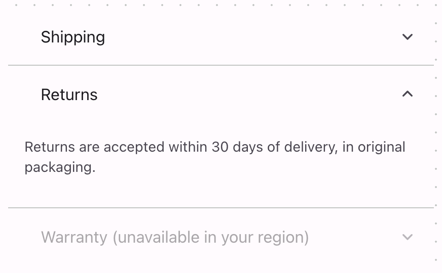

# @lit-material/accordion

Material Design 3-styled accordion / expansion panel web components built with [Lit](https://lit.dev/).
Part of [lit-material](https://github.com/bohdaq/lit-material).

Two elements: `lit-material-accordion-panel` (a disclosure widget — header + collapsible content)
and `lit-material-accordion` (groups panels, adding single-vs-multi expand policy and roving-focus
keyboard navigation), following the WAI-ARIA
[Accordion](https://www.w3.org/WAI/ARIA/apg/patterns/accordion/) pattern.



## Install

```sh
npm install @lit-material/accordion @lit-material/tokens
```

## Usage

```html
<link rel="stylesheet" href="node_modules/@lit-material/tokens/css/index.css" />
<script type="module">
  import "@lit-material/accordion";
</script>

<lit-material-accordion>
  <lit-material-accordion-panel expanded>
    <span slot="header">Shipping</span>
    <p>Orders ship within 3-5 business days.</p>
  </lit-material-accordion-panel>
  <lit-material-accordion-panel>
    <span slot="header">Returns</span>
    <p>Returns are accepted within 30 days of delivery.</p>
  </lit-material-accordion-panel>
</lit-material-accordion>
```

A panel works standalone too — no wrapping `lit-material-accordion` required:

```html
<lit-material-accordion-panel divider>
  <span slot="header">FAQ item</span>
  <p>Its answer.</p>
</lit-material-accordion-panel>
```

## `lit-material-accordion` API

| Property | Attribute | Type      | Default |
| -------- | --------- | --------- | ------- |
| `multi`  | `multi`   | `boolean` | `false` |

Slot: default (`lit-material-accordion-panel` elements). By default (`multi` unset), expanding a
panel collapses any other open panel in the group — a single-expand accordion. Set `multi` to let
panels open independently.

## `lit-material-accordion-panel` API

| Property   | Attribute  | Type      | Default |
| ---------- | ---------- | --------- | ------- |
| `expanded` | `expanded` | `boolean` | `false` |
| `disabled` | `disabled` | `boolean` | `false` |
| `divider`  | `divider`  | `boolean` | `false` |

Slots: `header` (the header label), `leading` (an optional icon before it), default (the body
content, shown when expanded). Fires `toggle` (`detail: { expanded }`) when `expanded` changes via
user interaction — not when set programmatically, so a parent accordion enforcing single-expand
mode doesn't cause a cascade of spurious events. `divider` draws a hairline rule below the panel;
`lit-material-accordion` uses it automatically between grouped panels, so it's mainly useful when
stacking standalone panels yourself.

## Behavior

The header is a real `<button>` (Enter/Space activate it for free, no custom keydown handling
needed for that part). The content region stays in the layout at all times and animates via a CSS
grid `0fr`/`1fr` track-size transition rather than a JS-measured height or an `auto`-height
transition (which browsers don't support animating) — it always animates to the content's actual
size, however that content changes. While collapsed, the content is `inert` — present for the
animation but unfocusable and hidden from the accessibility tree, so Tab can't land inside content
that's visually collapsed to zero height.

## Keyboard interaction

Within `lit-material-accordion`, Up/Down move focus between panel headers (wrapping, skipping
disabled panels), Home/End jump to the first/last enabled header. Enter/Space toggle the focused
panel (native button activation). A standalone panel (no wrapping accordion) only needs
Enter/Space, since there's nothing to roam between.

## Scope

No heading-level wrapper (`<h2>`-`<h6>`) around the header button — the APG reference example
wraps it in one, but asserting a specific level would fight whatever heading structure the page
already has, so this only sets the header as a plain button and relies on `aria-expanded` +
`role="region"`/`aria-labelledby` on the content for accessible structure. No nested accordions
scope cut deliberately — panels can contain arbitrary content, including another
`lit-material-accordion`, without any special handling either way.

## License

MIT
