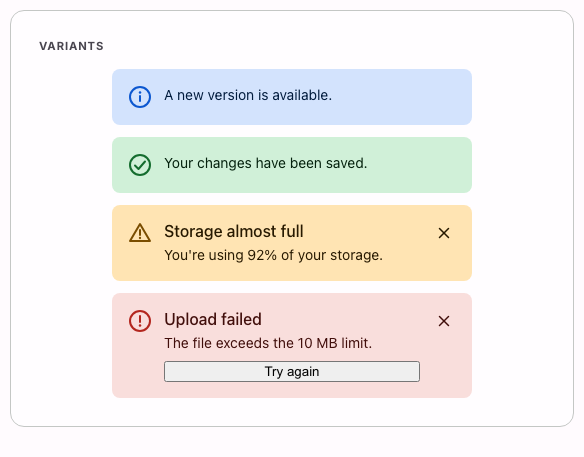

# @lit-material/alert

Material Design 3-styled alert web component built with [Lit](https://lit.dev/). Part of
[lit-material](https://github.com/bohdaq/lit-material).

A persistent inline/page-level banner — distinct from
[`@lit-material/snackbar`](https://github.com/bohdaq/lit-material/tree/main/packages/snackbar),
which is a transient, Popover-API-based toast that shows up temporarily and floats above content.
An alert is a normal part of the page layout: it stays until the user dismisses it (or the
consumer removes it), and never auto-dismisses on its own.



## Install

```sh
npm install @lit-material/alert @lit-material/tokens
```

## Usage

```html
<link rel="stylesheet" href="node_modules/@lit-material/tokens/css/index.css" />
<script type="module">
  import "@lit-material/alert";
</script>

<lit-material-alert variant="success">Your changes have been saved.</lit-material-alert>

<lit-material-alert variant="error" dismissible>
  <span slot="title">Upload failed</span>
  The file exceeds the 10 MB limit.
  <button slot="action">Try again</button>
</lit-material-alert>
```

## API

| Property      | Attribute     | Type                                            | Default  |
| ------------- | ------------- | ------------------------------------------------ | -------- |
| `variant`     | `variant`     | `"info" \| "success" \| "warning" \| "error"`     | `"info"` |
| `dismissible` | `dismissible` | `boolean`                                         | `false`  |

Methods: `dismiss()` — hides the alert (via the native `hidden` attribute) and fires `close`.

Slots: `icon` (overrides the variant's default icon), `title` (optional heading — slot exactly one
element), default (the description/body text), `action` (optional action buttons/links — for more
than one, wrap them in a single element yourself so they end up in one row instead of stacked).

Fires `close` when dismissed via the close button.

## Behavior

`warning`/`error` render `role="alert"` (an assertive live region); `info`/`success` render
`role="status"` (polite) — reserving the more interruptive announcement for the variants where
that's actually warranted, rather than every alert regardless of severity.

MD3 doesn't define standard color roles for "success"/"warning"/"info" the way it does for "error"
— those three are this component's own CSS custom properties
(`--lit-material-alert-info-color`/`-container`, etc.), overridable like any other design token.
`error` uses the real `--md-sys-color-error`/`-error-container` tokens since a spec answer exists
there.

## License

MIT
