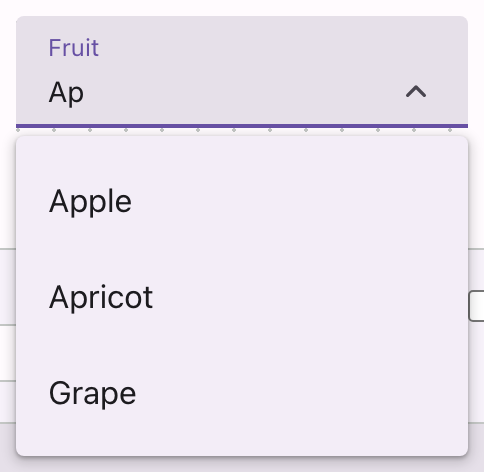

# @lit-material/autocomplete

Material Design 3-styled autocomplete web component built with [Lit](https://lit.dev/). Part of
[lit-material](https://github.com/bohdaq/lit-material).

A text field that filters a data-driven `options` list as the user types, following the WAI-ARIA
["Editable Combobox With List Autocomplete"](https://www.w3.org/WAI/ARIA/apg/patterns/combobox/examples/combobox-autocomplete-list/)
pattern.



## Install

```sh
npm install @lit-material/autocomplete @lit-material/tokens
```

## Usage

```html
<link rel="stylesheet" href="node_modules/@lit-material/tokens/css/index.css" />
<script type="module">
  import "@lit-material/autocomplete";
</script>

<lit-material-autocomplete id="fruit" name="fruit" label="Fruit" required></lit-material-autocomplete>
<script type="module">
  const el = document.getElementById("fruit");
  el.options = [
    { label: "Apple", value: "apple" },
    { label: "Apricot", value: "apricot" },
    { label: "Banana", value: "banana" },
    { label: "Blueberry", value: "blueberry", disabled: true },
    { label: "Cherry", value: "cherry" },
  ];
  el.addEventListener("change", () => console.log(el.value));
</script>
```

`options` is a plain JS property (an array, so it isn't practical to set as a static HTML
attribute in most cases) — set it directly, or via a JSON-stringified `options` attribute since
Lit's default `Array` type converter parses it: `options='[{"label":"Apple","value":"apple"}]'`.

## API

| Property         | Attribute        | Type                                                     | Default    |
| ---------------- | ---------------- | --------------------------------------------------------- | ---------- |
| `options`        | `options`        | `{ label: string; value: string; disabled?: boolean }[]`  | `[]`       |
| `variant`        | `variant`        | `"filled" \| "outlined"`                                   | `"filled"` |
| `label`          | `label`          | `string`                                                   | `""`       |
| `value`          | `value`          | `string`                                                   | `""`       |
| `placeholder`    | `placeholder`    | `string`                                                   | `""`       |
| `name`           | `name`           | `string`                                                   | `""`       |
| `required`       | `required`       | `boolean`                                                  | `false`    |
| `disabled`       | `disabled`       | `boolean`                                                  | `false`    |
| `error`          | `error`          | `boolean`                                                  | `false`    |
| `errorText`      | `error-text`     | `string`                                                   | `""`       |
| `supportingText` | `supporting-text`| `string`                                                   | `""`       |
| `open`           | `open`           | `boolean`                                                  | `false`    |
| `freeText`       | `free-text`      | `boolean`                                                  | `false`    |
| `form`           | `form`           | `string \| undefined`                                       | `undefined`|

Fires `change` when the committed value changes — an option picked (click or Enter), an exact
(case-insensitive) label match typed and then blurred, or, with `free-text`, arbitrary typed text
committed on blur. Form-associated via `ElementInternals` (participates in `FormData`, validation,
and form reset); `required` makes an empty value invalid.

## Behavior

Focusing or clicking the field opens the popover showing every option; typing filters it by a
case-insensitive substring match against each option's `label`. `disabled` options stay visible
(dimmed) but are skipped by keyboard navigation and clicks.

Committing a value only happens on an explicit action — clicking an option, pressing Enter with
one highlighted, or blurring the field:

- **Typed text exactly matches an option's label** (case-insensitive): that option is committed,
  same as clicking it.
- **No match, and `free-text` is set**: the typed text is committed as-is (`value` becomes
  whatever was typed).
- **No match, and `free-text` is unset (default)**: the edit is discarded — the field reverts to
  the last committed value's label. This keeps `value` always resolvable to one of `options`
  unless you opt into free text.
- **Field is emptied and blurred**: `value` clears, regardless of `free-text`.

## Keyboard interaction

Arrow Down/Up on a closed field opens it (highlighting the first/last option) without disturbing
what's typed; once open they move the highlight (no wrapping, skipping disabled options). Enter
commits the highlighted option, or falls back to the exact-match/free-text/revert resolution above
when nothing is highlighted. Escape closes the popover without touching the typed text or `value`.
Tab/clicking away blurs the field, which runs the same commit resolution as Enter.

Unlike `lit-material-select` — whose options are slotted elements, each in their own shadow root,
so highlighting has to be real roving `tabindex`/`focus()` because `aria-activedescendant` ID
references don't cross shadow-DOM boundaries — this component renders its options in the *same*
shadow root as the input. Real focus never leaves the `<input>` (so typing keeps working), and the
highlighted option is tracked purely via `aria-activedescendant`, which works correctly here since
there's no shadow boundary between the input and its options.

## Scope

No inline "ghost text" completion of the typed value (the WAI-ARIA pattern's "both" autocomplete
mode) — only the list-filtering half, which is simpler to get right across browsers and doesn't
fight manual text editing. No multi-select (pick one value, like `lit-material-select`, not many).
No leading/trailing icon slots.

## License

MIT
