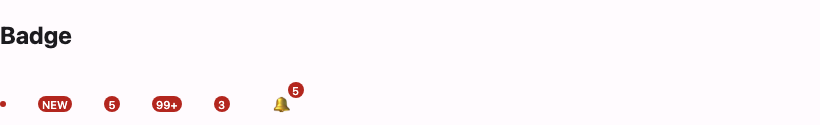

# @lit-material/badge

A Material Design 3 badge web component built with [Lit](https://lit.dev/). Part of
[lit-material](https://github.com/bohdaq/lit-material).



## Install

```sh
npm install @lit-material/badge @lit-material/tokens
```

## Usage

```html
<link rel="stylesheet" href="node_modules/@lit-material/tokens/css/index.css" />
<script type="module">
  import "@lit-material/badge";
</script>

<!-- Small dot: no value. -->
<lit-material-badge></lit-material-badge>

<!-- Large: any value, numbers clamped by max. -->
<lit-material-badge value="NEW"></lit-material-badge>
<lit-material-badge value="5"></lit-material-badge>
<lit-material-badge value="150" max="99"></lit-material-badge>
<!-- displays "99+" -->

<!-- Typical usage: overlaid on a corner of an icon button. -->
<span style="position: relative; display: inline-flex;">
  <lit-material-icon-button aria-label="Notifications, 5 unread">🔔</lit-material-icon-button>
  <lit-material-badge value="5" style="position: absolute; top: -2px; right: -2px;"></lit-material-badge>
</span>
```

## API

| Property | Attribute | Type                            | Default     |
| -------- | --------- | -------------------------------- | ----------- |
| `value`  | `value`    | `string \| number \| undefined` | `undefined` |
| `max`    | `max`      | `number`                         | `99`        |
| `label`  | `label`    | `string \| undefined`            | `undefined` |

With no `value`, the badge renders as a small dot (MD3's "small" badge). Set `value` — a number
(clamped by `max` to e.g. `"99+"`) or arbitrary text like `"NEW"` — and it grows into the
pill-shaped "large" badge automatically. Numeric-ness is decided by whether `value` *parses* as a
number, not by its JS type, so `value="150"` (an HTML attribute, always a string) and a
JS-assigned `el.value = 150` clamp identically.

There's deliberately no content slot — see the component source for why an earlier
slot-plus-auto-detection design didn't hold up under SSR, and why routing everything through
`value` instead is fully SSR-safe by construction.

Purely presentational — no dependency on `@lit-material/core` (nothing to click or focus).
Positioning (e.g. absolutely placed over a corner of an icon) is left to your own CSS, the same
reasoning [`@lit-material/top-app-bar`](https://github.com/bohdaq/lit-material/tree/main/packages/top-app-bar)
uses for its own positioning.

## Accessibility

A bare number or dot is meaningless out of context ("5" — five what?), and is usually paired with
a parent control that already describes it in its own `aria-label` (e.g. an icon button labeled
"Notifications, 5 unread", as in the example above). So by default the badge is `aria-hidden` —
purely decorative, adding nothing to the accessibility tree on top of that parent label.

Set `label` to override that and expose the badge as its own `role="status"` live region instead
— for a standalone badge with no describing parent. `aria-hidden` and `label` are mutually
exclusive by construction, not something to combine.

## License

MIT
