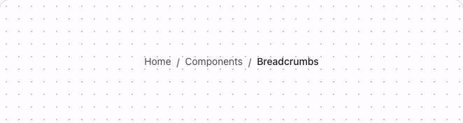

# @lit-material/breadcrumbs

Material Design 3-styled breadcrumbs web components built with [Lit](https://lit.dev/). Part of
[lit-material](https://github.com/bohdaq/lit-material).

A `<nav>` wrapping an `<ol>` of `lit-material-breadcrumb-item` links, showing the current page's
place in a hierarchy.



## Install

```sh
npm install @lit-material/breadcrumbs @lit-material/tokens
```

## Usage

```html
<link rel="stylesheet" href="node_modules/@lit-material/tokens/css/index.css" />
<script type="module">
  import "@lit-material/breadcrumbs";
</script>

<lit-material-breadcrumbs>
  <lit-material-breadcrumb-item href="/">Home</lit-material-breadcrumb-item>
  <lit-material-breadcrumb-item href="/components">Components</lit-material-breadcrumb-item>
  <lit-material-breadcrumb-item current>Breadcrumbs</lit-material-breadcrumb-item>
</lit-material-breadcrumbs>
```

## `lit-material-breadcrumbs` API

| Property | Attribute | Type     | Default        |
| -------- | --------- | -------- | -------------- |
| `label`  | `label`   | `string` | `"Breadcrumb"` |

Slot: default (`lit-material-breadcrumb-item` elements, root-to-current order). `label` is the
`<nav>` landmark's accessible name — override it for localization.

## `lit-material-breadcrumb-item` API

| Property  | Attribute | Type      | Default |
| --------- | --------- | --------- | ------- |
| `href`    | `href`    | `string`  | `""`    |
| `current` | `current` | `boolean` | `false` |

Slot: default (the crumb's label). A real `<a href>` when `href` is set and `current` is false;
plain text (`aria-current="page"` when `current`) otherwise — navigating to the page you're already
on doesn't make sense, so `current` always wins over `href`.

Each item draws its own trailing separator via `:host(:not(:last-of-type))::after` — the container
does no JS work to figure out which crumb is last. Override the
`--lit-material-breadcrumb-separator` CSS custom property (default `"/"`) for something else, e.g.
`--lit-material-breadcrumb-separator: "›"`.

## Behavior

A real link needs no custom keyboard handling — Tab and Enter already work natively — so unlike
most components in this library, `lit-material-breadcrumb-item` has no interactive JavaScript logic
of its own at all.

## Scope

No automatic collapsing of long trails (e.g. "Home / … / Settings" behind a menu when there are
many levels) — a real, distinct feature that's a reasonable follow-up rather than something to
half-build here.

## License

MIT
