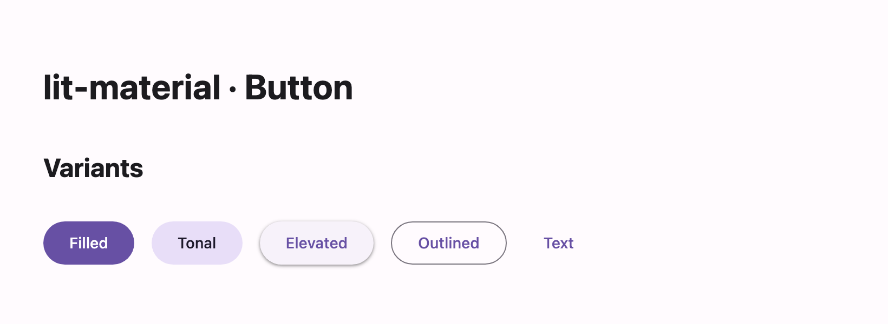

# @lit-material/button

A Material Design 3 button web component built with [Lit](https://lit.dev/). Part of
[lit-material](https://github.com/bohdaq/lit-material).



## Install

```sh
npm install @lit-material/button @lit-material/tokens
```

## Usage

```html
<link rel="stylesheet" href="node_modules/@lit-material/tokens/css/index.css" />
<script type="module">
  import "@lit-material/button";
</script>

<lit-material-button variant="filled">Save</lit-material-button>
<lit-material-button variant="outlined" disabled>Cancel</lit-material-button>
<lit-material-button variant="text" href="https://lit.dev">Docs</lit-material-button>
```

## API

| Property   | Attribute  | Type                                                             | Default    |
| ---------- | ---------- | ----------------------------------------------------------------| ---------- |
| `variant`  | `variant`  | `"filled" \| "tonal" \| "elevated" \| "outlined" \| "text"`      | `"filled"` |
| `type`     | `type`     | `"button" \| "submit" \| "reset"`                                | `"button"` |
| `disabled` | `disabled` | `boolean`                                                        | `false`    |
| `href`     | `href`     | `string`                                                         | `""`       |
| `target`   | `target`   | `string`                                                         | `""`       |
| `name`     | `name`     | `string`                                                         | `""`       |
| `value`    | `value`    | `string`                                                         | `""`       |
| `form`     | `form`     | `string \| undefined`                                            | `undefined`|

Slots: default (label), `icon` (leading icon).

`type="submit"` and `type="reset"` participate in an ancestor `<form>` via
`ElementInternals`; setting `href` renders an `<a>` instead of a `<button>`.

## License

MIT
