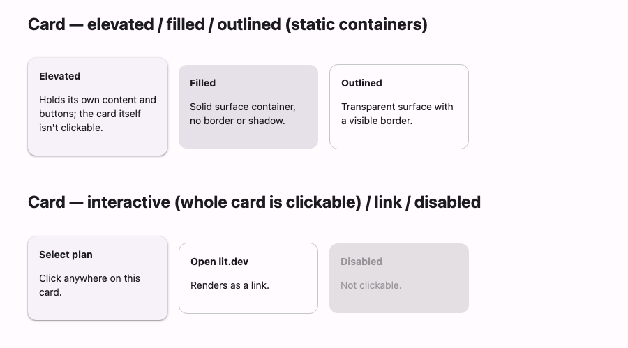

# @lit-material/card

A Material Design 3 card web component built with [Lit](https://lit.dev/). Part of
[lit-material](https://github.com/bohdaq/lit-material).



Elevated, filled, and outlined variants, optionally as a single interactive surface.

## Install

```sh
npm install @lit-material/card @lit-material/tokens
```

## Usage

```html
<link rel="stylesheet" href="node_modules/@lit-material/tokens/css/index.css" />
<script type="module">
  import "@lit-material/card";
</script>

<!-- Static container: holds its own buttons/links, the card itself isn't clickable. -->
<lit-material-card variant="outlined">
  <h3>Article title</h3>
  <p>Summary text…</p>
  <lit-material-button variant="text">Read more</lit-material-button>
</lit-material-card>

<!-- Interactive: the whole card is one clickable/tappable surface. -->
<lit-material-card interactive>Select this plan</lit-material-card>
<lit-material-card href="https://lit.dev" target="_blank">Open lit.dev</lit-material-card>
```

## API

| Property      | Attribute     | Type                                    | Default      |
| ------------- | ------------- | ---------------------------------------- | ------------ |
| `variant`     | `variant`     | `"elevated" \| "filled" \| "outlined"`    | `"elevated"` |
| `interactive` | `interactive` | `boolean`                                 | `false`      |
| `disabled`    | `disabled`    | `boolean`                                 | `false`      |
| `type`        | `type`        | `"button" \| "submit" \| "reset"`         | `"button"`   |
| `name`        | `name`        | `string`                                  | `""`         |
| `value`       | `value`       | `string`                                  | `""`         |
| `form`        | `form`        | `string \| undefined`                     | `undefined`  |
| `href`        | `href`        | `string`                                  | `""`         |
| `target`      | `target`      | `string`                                  | `""`         |

Slot: default (arbitrary content — media, text, its own buttons).

By default a card is a plain, non-interactive container: no hover/press feedback, no keyboard
focus, since it's expected to hold its own interactive elements (buttons, links). Set
`interactive`, or `href` (which implies it), to make the *entire card* a single clickable
surface instead — it then renders as a real `<button>` or `<a>` with the same ripple/focus-ring
treatment as [`@lit-material/button`](https://github.com/bohdaq/lit-material/tree/main/packages/button),
and `type="submit"`/`"reset"` participate in an ancestor `<form>` via `ElementInternals`, the same
way a button does.

## License

MIT
