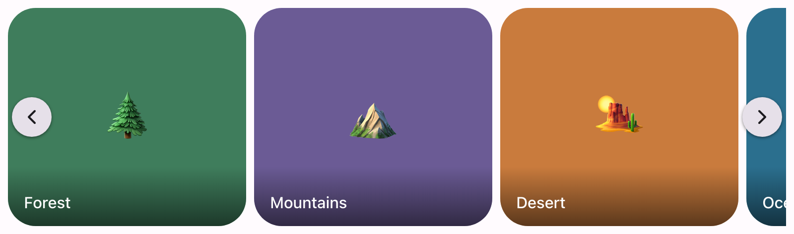

# @lit-material/carousel

A Material Design 3 carousel web component built with [Lit](https://lit.dev/), on native CSS
scroll-snap — no prior pattern in this repo to build on (there's no other horizontal-scroll
component), so this one is a fresh design rather than a variant of something existing. Part of
[lit-material](https://github.com/bohdaq/lit-material).



## Install

```sh
npm install @lit-material/carousel @lit-material/tokens
```

## Usage

```html
<link rel="stylesheet" href="node_modules/@lit-material/tokens/css/index.css" />
<script type="module">
  import "@lit-material/carousel";
</script>

<lit-material-carousel item-width="240px">
  <lit-material-carousel-item>
    
    <span slot="label">Lake</span>
  </lit-material-carousel-item>
  <lit-material-carousel-item>
    
    <span slot="label">Forest</span>
  </lit-material-carousel-item>
  <lit-material-carousel-item>
    
    <span slot="label">Mountains</span>
  </lit-material-carousel-item>
</lit-material-carousel>
```

## API

### `lit-material-carousel`

| Property         | Attribute            | Type      | Default   |
| ------------------ | ---------------------- | --------- | --------- |
| `itemWidth`       | `item-width`           | `string`  | `"280px"` |
| `showNavButtons`  | `show-nav-buttons`     | `boolean` | `true`    |

| Method                 | Description                                                              |
| ------------------------ | ---------------------------------------------------------------------------- |
| `next()`                 | Scrolls to the item after the current one, if any.                           |
| `prev()`                 | Scrolls to the item before the current one, if any.                          |
| `scrollToIndex(index)`   | Scrolls a specific item into view, clamped to the actual item range.         |

`itemWidth` is any CSS length, applied to every item via the `--lit-material-carousel-item-width`
custom property (see `lit-material-carousel-item` below) — every item is the same width; the MD3
spec's multiple carousel layouts (multi-browse, hero, etc., which vary item sizes *within* one
carousel) aren't implemented, see Scope. Two more custom properties style the carousel itself:
`--lit-material-carousel-height` (default `220px`) and `--lit-material-carousel-gap` (default
`8px`, the spacing between items and the track's own inline padding).

Slot: default (`lit-material-carousel-item` elements).

### `lit-material-carousel-item`

Purely presentational — sized by the parent's `--lit-material-carousel-item-width`, nothing else
to configure.

Slots: default (the slide's content — typically an ``, cropped with `object-fit: cover`, but
any content works), `label` (an optional caption, overlaid at the bottom with a scrim gradient so
light text stays readable over an image; omit it and neither the scrim nor its space are
rendered).

## Behavior

The track is a native CSS scroll-snap container (`scroll-snap-type: x mandatory`) — touch swipes,
trackpad/mouse-wheel scrolling, and click-and-drag scrollbar behavior all already work exactly as
they would on any horizontally scrollable element, since that's what it is. `next()`/`prev()`, the
overlaid nav buttons, and ArrowLeft/ArrowRight (once the track has focus) are added on top, all
implemented as `item.scrollIntoView({ behavior: "smooth" })` rather than manual `scrollLeft` math —
deliberately, since `scrollLeft` is measured inconsistently across browsers under `dir="rtl"`,
while `scrollIntoView` isn't direction-sensitive at all.

Which item currently counts as "current" (for `next()`/`prev()` to know which item is adjacent,
and to disable the nav buttons at either end) is tracked with an `IntersectionObserver` watching
each item against the track, for the same RTL-safety reason — intersection ratios aren't affected
by which direction the track happens to scroll in.

## Scope

Deliberately out of scope for this first pass, all reasonable follow-ups rather than silently
missing pieces:

- Dragging/swiping to scroll beyond what the track's native scrollability already provides — this
  doesn't add its *own* pointer-drag handling on top of a plain scrollable element.
- The MD3 spec's multiple carousel layouts (multi-browse, hero, full-screen, etc.) that vary item
  sizes *within* one carousel — every item shares one `itemWidth` here.
- An "active index" property/event, or auto-advancing (a slideshow-style timer) — this is a
  scroll-snap container plus navigation affordances, not a slideshow component.

## License

MIT
