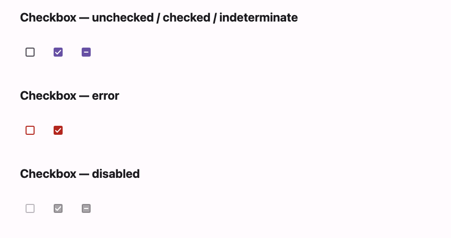

# @lit-material/checkbox

A Material Design 3 checkbox web component built with [Lit](https://lit.dev/). Part of
[lit-material](https://github.com/bohdaq/lit-material).



Checked, unchecked, and indeterminate states, an error state, and native form participation.

## Install

```sh
npm install @lit-material/checkbox @lit-material/tokens
```

## Usage

```html
<link rel="stylesheet" href="node_modules/@lit-material/tokens/css/index.css" />
<script type="module">
  import "@lit-material/checkbox";
</script>

<lit-material-checkbox aria-label="Accept terms"></lit-material-checkbox>
<lit-material-checkbox aria-label="Subscribed" checked></lit-material-checkbox>
<lit-material-checkbox aria-label="Select all" indeterminate></lit-material-checkbox>
<lit-material-checkbox aria-label="Accept terms" required error></lit-material-checkbox>
<lit-material-checkbox aria-label="Locked" checked disabled></lit-material-checkbox>
```

## API

| Property     | Attribute | Type                  | Default |
| ------------ | --------- | --------------------- | ------- |
| `checked`    | `checked` | `boolean`              | `false` |
| `indeterminate` | `indeterminate` | `boolean`       | `false` |
| `disabled`   | `disabled` | `boolean`             | `false` |
| `error`      | `error`   | `boolean`              | `false` |
| `required`   | `required` | `boolean`             | `false` |
| `name`       | `name`    | `string`               | `""`    |
| `value`      | `value`   | `string`               | `"on"`  |
| `form`       | `form`    | `string \| undefined`  | `undefined` |

Checkboxes have no visible label, so set `aria-label` or `aria-labelledby`.

`indeterminate` is a visual-only "partially checked" state; the next user interaction (click or
Space) clears it and toggles `checked`, matching native `<input type="checkbox">` behavior. The
checkbox is form-associated via `ElementInternals` (participates in `FormData`, validation, and
form reset): unchecked submits nothing, checked submits `value` (default `"on"`), and `required`
makes an unchecked box invalid.

## License

MIT
