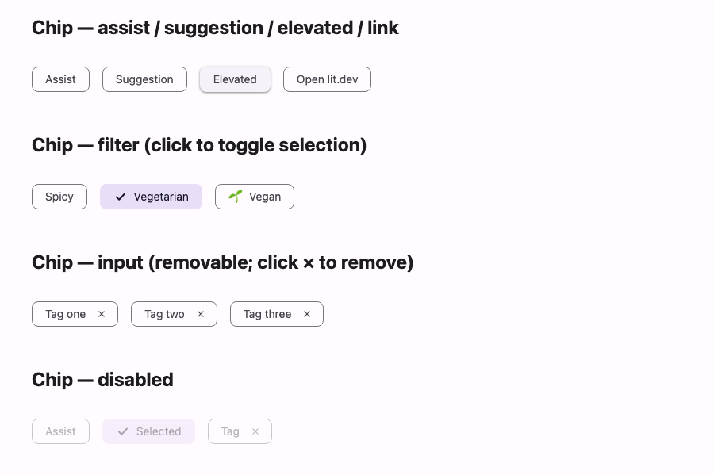

# @lit-material/chip

A Material Design 3 chip web component built with [Lit](https://lit.dev/). Part of
[lit-material](https://github.com/bohdaq/lit-material).



Assist, filter, input, and suggestion variants, an elevated style, and a removable trailing button.

## Install

```sh
npm install @lit-material/chip @lit-material/tokens
```

## Usage

```html
<link rel="stylesheet" href="node_modules/@lit-material/tokens/css/index.css" />
<script type="module">
  import "@lit-material/chip";
</script>

<lit-material-chip>Assist</lit-material-chip>
<lit-material-chip elevated>Elevated assist</lit-material-chip>
<lit-material-chip href="https://lit.dev" target="_blank">Open lit.dev</lit-material-chip>

<lit-material-chip variant="filter">Spicy</lit-material-chip>
<lit-material-chip variant="filter" selected>Vegetarian</lit-material-chip>

<lit-material-chip variant="input" removable>Tag one</lit-material-chip>

<lit-material-chip variant="suggestion">Nearby</lit-material-chip>
```

## API

| Property    | Attribute | Type                                                | Default    |
| ----------- | --------- | ---------------------------------------------------- | ---------- |
| `variant`   | `variant` | `"assist" \| "filter" \| "input" \| "suggestion"`     | `"assist"` |
| `selected`  | `selected` | `boolean`                                            | `false`    |
| `disabled`  | `disabled` | `boolean`                                            | `false`    |
| `elevated`  | `elevated` | `boolean`                                            | `false`    |
| `removable` | `removable` | `boolean`                                           | `false`    |
| `href`      | `href`    | `string`                                              | `""`       |
| `target`    | `target`  | `string`                                              | `""`       |

Slots: default (label), `leading-icon` (ignored on a selected `filter` chip, which shows a
checkmark in its place).

`variant` is presentational, not exclusive: `selected` and `removable` work on any variant, though
conventionally `selected` toggling is used with `filter` chips and `removable` with `input` chips.
Clicking a `filter` chip toggles `selected` and fires `change`; the trailing remove button (shown
when `removable`) fires a cancelable `remove` event and, unless `event.preventDefault()` is
called, removes the chip from the DOM.

Unlike checkbox/radio/switch, chips are **not** form-associated — they're auxiliary UI (filters,
action triggers, removable tags), not a value a `<form>` submits, matching how Material Design
itself treats chips. Track a `filter` chip set's selection or an `input` chip list by listening for
`change`/`remove` rather than reading `FormData`.

## License

MIT
