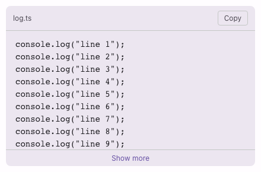

# @lit-material/code-block

Material Design 3-styled code block web component built with [Lit](https://lit.dev/). Part of
[lit-material](https://github.com/bohdaq/lit-material).

A monospace container for a block of source code — a filename/language label, a
copy-to-clipboard button, and optional truncation for long snippets.



## Install

```sh
npm install @lit-material/code-block @lit-material/tokens
```

## Usage

```html
<link rel="stylesheet" href="node_modules/@lit-material/tokens/css/index.css" />
<script type="module">
  import "@lit-material/code-block";
</script>

<lit-material-code-block label="index.ts">
  export function add(a: number, b: number): number {
    return a + b;
  }
</lit-material-code-block>

<lit-material-code-block expandable>
  <!-- a long snippet — collapses to a fixed height with a "Show more" toggle -->
</lit-material-code-block>
```

## API

| Property     | Attribute    | Type      | Default |
| ------------ | ------------ | --------- | ------- |
| `label`      | `label`      | `string`  | `""`    |
| `copyable`   | `copyable`   | `boolean` | `true`  |
| `expandable` | `expandable` | `boolean` | `false` |
| `expanded`   | `expanded`   | `boolean` | `false` |

Methods: `copy()` — writes the element's text content to the clipboard and fires `copy`.

Slot: default — the code content (plain text, or pre-highlighted markup from your own
highlighter).

Fires `copy` after `copy()` writes the code's text to the clipboard.

## Behavior

Deliberately doesn't syntax-highlight: that's a real, separate feature (tokenizing a specific
language, shipping a grammar/theme) that belongs to a dedicated highlighting library, not this
component — slot in pre-highlighted markup yourself if you need it, the same way a `<pre>` element
itself doesn't care what's inside it.

The header (label and/or copy button) only renders when there's something to put in it — no label
and `copyable="false"` together mean no header at all, not an empty band.

`expandable` clips the code to a fixed height with a "Show more"/"Show less" toggle, rather than
hiding it outright — useful for long snippets where you want a compact default without losing the
option to see everything.

## License

MIT
