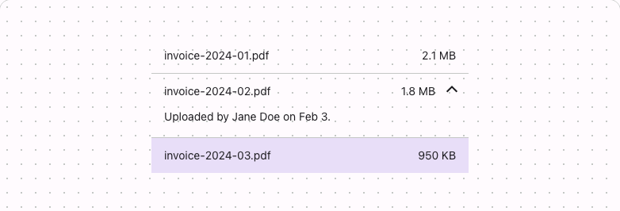

# @lit-material/data-list

Material Design 3-styled data list web components built with [Lit](https://lit.dev/). Part of
[lit-material](https://github.com/bohdaq/lit-material).

A list of flexible, multi-cell rows, optionally expandable — distinct from
`@lit-material/data-table`, whose rows all share the same fixed columns.



## Install

```sh
npm install @lit-material/data-list @lit-material/tokens
```

## Usage

```html
<link rel="stylesheet" href="node_modules/@lit-material/tokens/css/index.css" />
<script type="module">
  import "@lit-material/data-list";
</script>

<lit-material-data-list>
  <lit-material-data-list-item>
    <lit-material-data-list-cell fill>invoice-2024-01.pdf</lit-material-data-list-cell>
    <lit-material-data-list-cell>2.1 MB</lit-material-data-list-cell>
  </lit-material-data-list-item>
  <lit-material-data-list-item expandable>
    <lit-material-data-list-cell fill>invoice-2024-02.pdf</lit-material-data-list-cell>
    <lit-material-data-list-cell>1.8 MB</lit-material-data-list-cell>
    <span slot="expanded-content">Uploaded by Jane Doe on Feb 3.</span>
  </lit-material-data-list-item>
</lit-material-data-list>
```

## `lit-material-data-list-item` API

| Property     | Attribute    | Type      | Default |
| ------------ | ------------ | --------- | ------- |
| `selected`   | `selected`   | `boolean` | `false` |
| `expandable` | `expandable` | `boolean` | `false` |
| `open`       | `open`       | `boolean` | `false` |

Slots: default (the row's content — typically `lit-material-data-list-cell` elements),
`expanded-content` (extra content revealed when `expandable` and `open`).

Fires `toggle` after `open` changes via user interaction, when `expandable`.

## `lit-material-data-list-cell` API

| Property | Attribute | Type      | Default |
| -------- | --------- | --------- | ------- |
| `fill`   | `fill`    | `boolean` | `false` |

`fill` grows to take up remaining row width (typically the row's main content cell); cells without
it size to their own content (typically an icon or an actions cell).

## Behavior

`expandable` switches the row to a native `<details>`/`<summary>` — the row's own content becomes
the always-visible `<summary>`, and `expanded-content` reveals underneath it — rather than
reimplementing disclosure state, ARIA, and keyboard handling by hand the way
`lit-material-accordion` does with its own expand/collapse machinery. `<details>` doesn't fire its
native `toggle` event across a shadow boundary (it neither bubbles nor composes), so
`lit-material-data-list-item` re-dispatches its own `toggle` from the host — listen for that, not
the inner one you can't reach anyway.

## License

MIT
