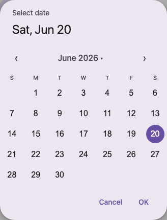
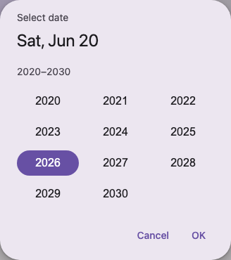

# @lit-material/date-picker

A Material Design 3 modal date picker web component built with [Lit](https://lit.dev/). Part of
[lit-material](https://github.com/bohdaq/lit-material).




## Install

```sh
npm install @lit-material/date-picker @lit-material/tokens
```

## Usage

```html
<link rel="stylesheet" href="node_modules/@lit-material/tokens/css/index.css" />
<script type="module">
  import "@lit-material/date-picker";
</script>

<lit-material-button id="open-btn">Choose date</lit-material-button>
<lit-material-date-picker
  id="date-picker"
  value="2026-06-15"
  min="2026-01-01"
  max="2026-12-31"
></lit-material-date-picker>

<script type="module">
  const picker = document.querySelector("#date-picker");
  document.querySelector("#open-btn").addEventListener("click", () => picker.show());
  picker.addEventListener("change", () => console.log(picker.value));
</script>
```

## API

| Property          | Attribute            | Type                   | Default        |
| ------------------ | --------------------- | ----------------------- | -------------- |
| `open`             | `open`                 | `boolean`                | `false`        |
| `value`            | `value`                 | `string \| undefined`   | `undefined`    |
| `min`              | `min`                   | `string \| undefined`   | `undefined`    |
| `max`              | `max`                   | `string \| undefined`   | `undefined`    |
| `label`            | `label`                 | `string`                 | `"Select date"` |
| `firstDayOfWeek`   | `first-day-of-week`     | `number`                 | `0` (Sunday)   |

`value`/`min`/`max` are ISO `"YYYY-MM-DD"` strings — parsed and formatted with plain year/month/day
arithmetic rather than `new Date(isoString)`, which parses as UTC and is a classic source of
off-by-one-day bugs in negative-UTC-offset timezones.

Methods: `show()` opens the picker, resetting its view to `value` (or today) — equivalent to
`open = true` after that reset. `close(returnValue?)` closes it without confirming a selection.

Fires `change` when a date is confirmed via "OK" and `value` actually changed; `cancel`/`close`,
re-dispatched from the native `<dialog>` events (Escape, a backdrop click, or the Cancel button all
land here) the same way [`@lit-material/dialog`](https://github.com/bohdaq/lit-material/tree/main/packages/dialog)
re-dispatches its own.

## Behavior

Tapping a day highlights it immediately but doesn't commit it — the same two-step "pick, then
confirm" flow the MD3 spec calls for. `change` only fires once "OK" is clicked; "Cancel" (or
Escape, or a backdrop click) discards the in-progress selection and leaves `value` untouched.

The month/year label toggles a scrollable grid of years; picking one returns to the calendar on
that year, same month. Out-of-range days (per `min`/`max`) are disabled, and month/year navigation
is disabled once it would leave the range entirely.

Keyboard support inside the calendar grid: arrow keys move the focused day by one (Left/Right) or
one week (Up/Down), crossing month boundaries where needed; Home/End jump to the first/last day of
the visible month. Out-of-range days are skipped automatically when navigating past them.

## Scope

Deliberately out of scope for this first pass, all reasonable follow-ups rather than silently
missing pieces:

- The manual keyboard-entry text field mode MD3 lets you toggle to — this is calendar-only.
- A docked (non-modal, inline) variant — this is modal-only, built on the native `<dialog>` like
  `@lit-material/dialog`.
- Date *range* selection — a separate Date Range Picker component in the MD3 spec.

## License

MIT
