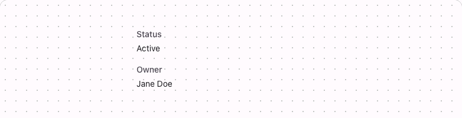

# @lit-material/description-list

Material Design 3-styled description list web components built with [Lit](https://lit.dev/). Part
of [lit-material](https://github.com/bohdaq/lit-material).

Metadata display — a set of term/description pairs — distinct from `@lit-material/list`'s
interactive item list and `@lit-material/data-table`'s columnar tabular data.



## Install

```sh
npm install @lit-material/description-list @lit-material/tokens
```

## Usage

```html
<link rel="stylesheet" href="node_modules/@lit-material/tokens/css/index.css" />
<script type="module">
  import "@lit-material/description-list";
</script>

<lit-material-description-list>
  <lit-material-description-list-group>
    <span slot="term">Status</span>
    Active
  </lit-material-description-list-group>
  <lit-material-description-list-group>
    <span slot="term">Owner</span>
    Jane Doe
  </lit-material-description-list-group>
</lit-material-description-list>
```

## `lit-material-description-list` API

| Property     | Attribute    | Type      | Default |
| ------------ | ------------ | --------- | ------- |
| `horizontal` | `horizontal` | `boolean` | `false` |

Slot: default (`lit-material-description-list-group` elements). `horizontal` lays every group's
term and description side by side in a two-column grid instead of stacking description below term.

## `lit-material-description-list-group` API

No properties. Slots: `term` (a label, a field name), default (the description).

## Behavior

Renders `role="list"`/`role="listitem"`/`role="term"`/`role="definition"` rather than native
`<dl>`/`<dt>`/`<dd>`: axe's `dl`-content-model rule checks direct-child *tag names* only, so a real
`<dl>` here would fail automated accessibility checks no matter what
`lit-material-description-list-group` renders internally, the same way `role="listitem"` already
sidesteps needing a native `<li>` for `lit-material-breadcrumb-item`. ARIA's
`list`/`listitem`/`term`/`definition` roles are the standard fallback for exactly this
can't-use-the-native-element case.

`lit-material-description-list-group` is `display: contents` — no box of its own — so the list's
`horizontal` two-column grid applies directly to every group's term/description elements as if they
were the list's own flattened children.

## License

MIT
