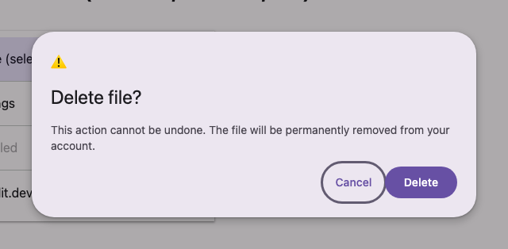

# @lit-material/dialog

A Material Design 3 (basic) dialog web component built with [Lit](https://lit.dev/) on top of the
native `<dialog>` element. Part of [lit-material](https://github.com/bohdaq/lit-material).



## Install

```sh
npm install @lit-material/dialog @lit-material/tokens
```

## Usage

```html
<link rel="stylesheet" href="node_modules/@lit-material/tokens/css/index.css" />
<script type="module">
  import "@lit-material/dialog";
</script>

<lit-material-dialog id="confirm-delete">
  <span slot="headline">Delete file?</span>
  This can't be undone.
  <div slot="actions">
    <!-- A method="dialog" submit closes the dialog natively and sets returnValue — no JS needed. -->
    <form method="dialog">
      <button value="cancel">Cancel</button>
      <button value="delete">Delete</button>
    </form>
  </div>
</lit-material-dialog>

<script type="module">
  const dialog = document.getElementById("confirm-delete");
  dialog.addEventListener("close", () => console.log(dialog.returnValue));
</script>
```

Or drive it imperatively:

```js
dialog.show(); // same as dialog.open = true
dialog.close("cancel"); // same as dialog.open = false, plus sets returnValue
```

## API

| Property               | Attribute                | Type      | Default |
| ----------------------- | ------------------------- | --------- | ------- |
| `open`                  | `open`                     | `boolean` | `false` |
| `disableBackdropClose`  | `disable-backdrop-close`  | `boolean` | `false` |

| Method                        | Description                                              |
| ------------------------------ | ---------------------------------------------------------- |
| `show()`                       | Opens the dialog (`open = true`).                          |
| `close(returnValue?)`           | Closes the dialog (`open = false`), optionally setting `returnValue`. |

`returnValue` (getter) reflects the underlying `<dialog>`'s `returnValue`, set via `close()` or a
`method="dialog"` form submission.

Slots: `icon` (optional, centered above the headline), `headline` (title), default (body content),
`actions` (buttons, right-aligned).

Built on the native `<dialog>` element, so focus trapping, initial focus, top-layer stacking, and
Escape-to-close all come from the browser. Clicking the backdrop closes the dialog unless
`disable-backdrop-close` is set. `cancel` (fired on Escape, before `close`) is cancelable — call
`event.preventDefault()` on it to keep the dialog open.

## Events

| Event    | Cancelable | Fires                                                          |
| -------- | ---------- | ---------------------------------------------------------------- |
| `cancel` | Yes        | On Escape, before the dialog closes.                              |
| `close`  | No         | After the dialog closes (via `close()`, Escape, backdrop click, or a `method="dialog"` form submit). |

## License

MIT
