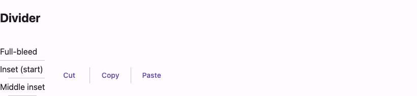

# @lit-material/divider

A Material Design 3 divider web component built with [Lit](https://lit.dev/). Part of
[lit-material](https://github.com/bohdaq/lit-material).



## Install

```sh
npm install @lit-material/divider @lit-material/tokens
```

## Usage

```html
<link rel="stylesheet" href="node_modules/@lit-material/tokens/css/index.css" />
<script type="module">
  import "@lit-material/divider";
</script>

<!-- Full-bleed (default). -->
<lit-material-divider></lit-material-divider>

<!-- Inset — e.g. aligned with a list item's text, not its leading icon. -->
<lit-material-divider inset-start></lit-material-divider>

<!-- "Middle inset" — indented on both sides. -->
<lit-material-divider inset-start inset-end></lit-material-divider>

<!-- Vertical, e.g. between two toolbar buttons in a flex row. -->
<div style="display: flex; align-items: center; gap: 8px;">
  <lit-material-button variant="text">Cut</lit-material-button>
  <lit-material-divider orientation="vertical"></lit-material-divider>
  <lit-material-button variant="text">Copy</lit-material-button>
</div>
```

## API

| Property     | Attribute      | Type                          | Default        |
| ------------- | --------------- | -------------------------------- | -------------- |
| `orientation` | `orientation`    | `"horizontal" \| "vertical"`     | `"horizontal"` |
| `insetStart`  | `inset-start`    | `boolean`                         | `false`        |
| `insetEnd`    | `inset-end`      | `boolean`                         | `false`        |

No slot — purely visual, with no shadow DOM content at all. The host element itself *is* the
line, styled directly via `:host`. No dependency on `@lit-material/core` (nothing to click or
focus).

`insetStart`/`insetEnd` indent the line on the axis perpendicular to it — inline (left/right) for
a horizontal divider, block (top/bottom) for a vertical one. Neither set is a full-bleed divider;
both set is MD3's "middle inset" variant.

`role="separator"` is set automatically, with `aria-orientation="vertical"` added when
`orientation` is vertical (the ARIA default is horizontal, so it's omitted in that case).

## License

MIT
