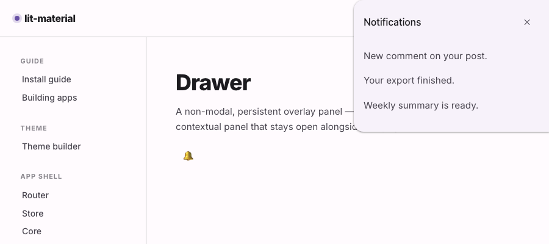

# @lit-material/drawer

Material Design 3-styled drawer web component built with [Lit](https://lit.dev/). Part of
[lit-material](https://github.com/bohdaq/lit-material).

A non-modal, persistent overlay panel — for a notification drawer, an activity feed, or any
contextual panel that should stay open alongside the page rather than blocking it.



## Install

```sh
npm install @lit-material/drawer @lit-material/tokens
```

## Usage

```html
<link rel="stylesheet" href="node_modules/@lit-material/tokens/css/index.css" />
<script type="module">
  import "@lit-material/drawer";
</script>

<button id="bell">Notifications</button>

<lit-material-drawer id="notifications">
  <div slot="header">
    <span>Notifications</span>
    <button id="close-notifications" aria-label="Close">✕</button>
  </div>
  <p>New comment on your post.</p>
  <p>Your export finished.</p>
</lit-material-drawer>

<script type="module">
  document.getElementById("bell").addEventListener("click", () => {
    document.getElementById("notifications").show();
  });
  document.getElementById("close-notifications").addEventListener("click", () => {
    document.getElementById("notifications").close();
  });
</script>
```

## API

| Property   | Attribute  | Type               | Default |
| ---------- | ---------- | ------------------ | ------- |
| `open`     | `open`     | `boolean`          | `false` |
| `position` | `position` | `"start" \| "end"` | `"end"` |

Methods: `show()`, `close()` — equivalent to setting `.open = true` / `.open = false`.

Slots: `header` (optional — slot exactly one wrapping element, e.g. a `<div>` containing a title and
a close button), default (the drawer's content).

Sets `role="complementary"` and `popover="manual"` on itself.

## Behavior

Built on the native Popover API (`popover="manual"`, the same foundation `lit-material-tooltip`
uses), not `<dialog>` — there's no scrim, no focus trap, and no Escape-to-close, because unlike
`lit-material-side-sheet`'s `modal` variant, this component doesn't demand the user deal with it
before doing anything else. `popover="manual"` also means it never light-dismisses on an outside
click the way an `auto` popover (`lit-material-menu`, `lit-material-speed-dial`) would —
"persistent" is the point, so closing it is always an explicit action: a close button you put in
`header`, or calling `close()` yourself.

Being a popover, it renders in the browser's top layer — always above other content, with no
z-index bookkeeping required — and is `position: fixed` to the viewport, sized and positioned by
`position` rather than by wherever it happens to sit in the DOM.

## Scope

No entrance/exit motion (matching `lit-material-side-sheet` and
`lit-material-navigation-drawer`'s current scope) — a reasonable follow-up rather than something to
half-build here.

## License

MIT
