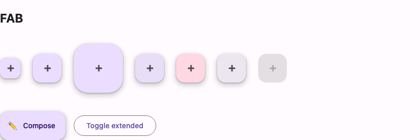

# @lit-material/fab

A Material Design 3 floating action button (FAB) web component built with
[Lit](https://lit.dev/). Part of [lit-material](https://github.com/bohdaq/lit-material).



## Install

```sh
npm install @lit-material/fab @lit-material/tokens
```

## Usage

```html
<link rel="stylesheet" href="node_modules/@lit-material/tokens/css/index.css" />
<script type="module">
  import "@lit-material/fab";
</script>

<lit-material-fab aria-label="Compose">
  <svg slot="icon">…</svg>
</lit-material-fab>

<lit-material-fab extended aria-label="Compose">
  <svg slot="icon">…</svg>
  Compose
</lit-material-fab>

<lit-material-fab size="large" color="secondary" aria-label="Compose">
  <svg slot="icon">…</svg>
</lit-material-fab>
```

## API

| Property             | Attribute  | Type                                                     | Default     |
| --------------------- | ---------- | ---------------------------------------------------------- | ----------- |
| `size`                | `size`      | `"small" \| "regular" \| "large"`                           | `"regular"` |
| `color`               | `color`     | `"primary" \| "secondary" \| "tertiary" \| "surface"`        | `"primary"` |
| `extended`            | `extended`  | `boolean`                                                    | `false`     |
| `disabled`            | `disabled`  | `boolean`                                                    | `false`     |
| `type`                | `type`      | `"button" \| "submit" \| "reset"`                            | `"button"`  |
| `name`                | `name`      | `string`                                                     | `""`        |
| `value`               | `value`     | `string`                                                     | `""`        |
| `form`                | `form`      | `string \| undefined`                                        | `undefined` |
| `href`                | `href`      | `string`                                                     | `""`        |
| `target`              | `target`    | `string`                                                     | `""`        |

Slots: `icon` (the action's icon), default (label text, shown only while `extended` is set).

`size` is ignored while `extended` is set — an extended FAB is always regular-height per the MD3
spec. The label is always mounted in the DOM (not conditionally rendered), so toggling `extended`
animates its width smoothly instead of popping the text in and out — handy for a common pattern
like collapsing to icon-only while the user scrolls. Driving `extended` from scroll direction is
left to your own listener, the same scope cut
[`@lit-material/top-app-bar`](https://github.com/bohdaq/lit-material/tree/main/packages/top-app-bar)
makes for its own scroll-linked behavior.

Built on the same button/ripple/focus-ring/form-association pattern as
[`@lit-material/button`](https://github.com/bohdaq/lit-material/tree/main/packages/button) and
[`@lit-material/icon-button`](https://github.com/bohdaq/lit-material/tree/main/packages/icon-button) —
renders a real `<button>`, or an `<a>` when `href` is set, and `type="submit"`/`"reset"`
participate in an ancestor `<form>` via `ElementInternals`.

Has no visible label when not `extended`: set `aria-label` or `aria-labelledby` in that case.

MD3 guidance is that FABs stay visible and enabled at all times (hide the whole button rather
than disabling it) — `disabled` is still supported for API consistency with the rest of the
library, but reach for it sparingly.

## License

MIT
