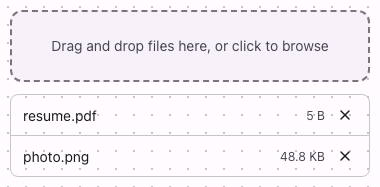

# @lit-material/file-upload

Material Design 3-styled file upload web component built with [Lit](https://lit.dev/). Part of
[lit-material](https://github.com/bohdaq/lit-material).

Drag-and-drop or click-to-browse file picking — a single file, or (with `multiple`) several,
mirroring the native `<input type="file" multiple>` attribute rather than being two separate
components for the two cases.



## Install

```sh
npm install @lit-material/file-upload @lit-material/tokens
```

## Usage

```html
<link rel="stylesheet" href="node_modules/@lit-material/tokens/css/index.css" />
<script type="module">
  import "@lit-material/file-upload";
</script>

<lit-material-file-upload name="resume" accept="application/pdf"></lit-material-file-upload>

<lit-material-file-upload name="attachments" multiple label="Drop files or click to browse"></lit-material-file-upload>
```

## API

| Property   | Attribute  | Type      | Default |
| ---------- | ---------- | --------- | ------- |
| `multiple` | `multiple` | `boolean` | `false` |
| `accept`   | `accept`   | `string`  | `""`    |
| `disabled` | `disabled` | `boolean` | `false` |
| `label`    | `label`    | `string`  | `""`    |
| `name`     | `name`     | `string`  | `""`    |

`files` (getter/setter, not an attribute) — the currently selected `File[]`. Assign to it to set the
selection programmatically.

Methods: `removeFile(index)` — removes one file by index.

Slot: default — overrides the dropzone's instructions text (`label` is the simpler option for plain
text; use the slot for richer markup).

Fires `change` whenever the file selection changes (add or remove).

## Behavior

The actual picking is a real `<input type="file">`, visually hidden but still in the tab order and
keyboard-operable (Enter/Space opens the native picker) via the `<label>` wrapping it — no custom
keyboard handling needed for that part at all. Dropping a file anywhere on the component (not just
the label) adds it; dropping again with `multiple` appends rather than replacing, matching how
repeatedly picking files via the native dialog behaves.

Form-associated via `ElementInternals`: a single file sets the form value directly to that `File`;
multiple files build a `FormData` with one entry per file under `name`, matching how a native
`<input type="file" multiple>` submits.

## License

MIT
