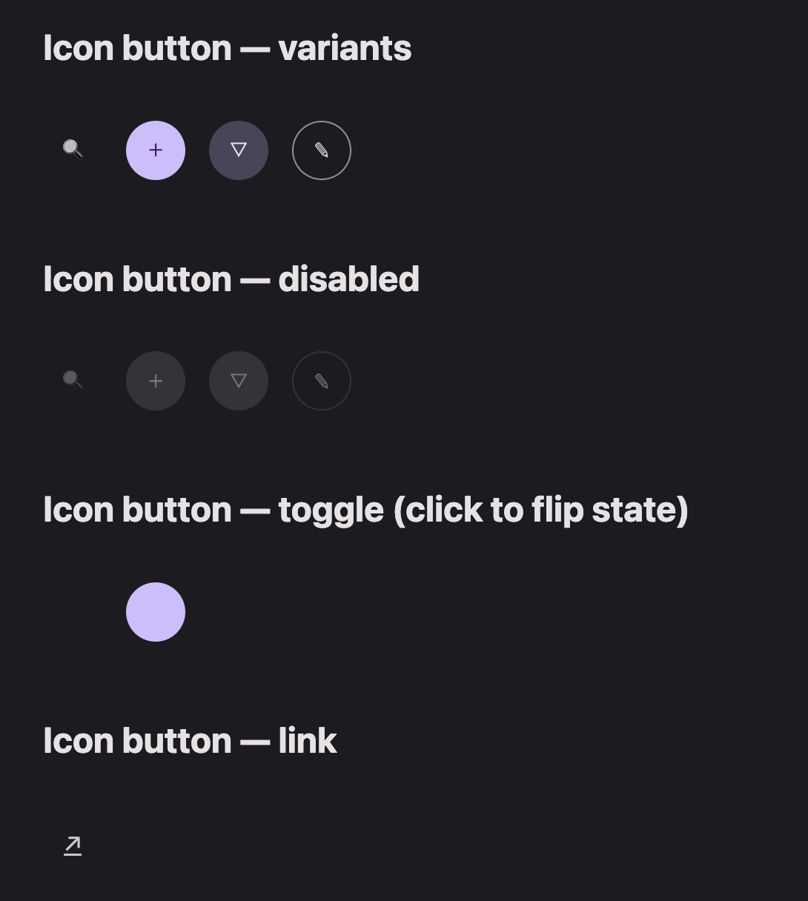

# @lit-material/icon-button

A Material Design 3 icon button web component built with [Lit](https://lit.dev/). Part of
[lit-material](https://github.com/bohdaq/lit-material).



Supports standard and toggle variants.

## Install

```sh
npm install @lit-material/icon-button @lit-material/tokens
```

## Usage

```html
<link rel="stylesheet" href="node_modules/@lit-material/tokens/css/index.css" />
<script type="module">
  import "@lit-material/icon-button";
</script>

<!-- Standard icon button (remember to label it!) -->
<lit-material-icon-button aria-label="Search">
  <svg slot="icon" ...></svg>
</lit-material-icon-button>

<!-- Toggle: clicks flip `selected`, emits `change` -->
<lit-material-icon-button toggle aria-label="Mute">
  <svg slot="icon" ...></svg>            <!-- off icon -->
  <svg slot="selected-icon" ...></svg>   <!-- on icon -->
</lit-material-icon-button>

<!-- Link -->
<lit-material-icon-button aria-label="Open lit.dev" href="https://lit.dev"></lit-material-icon-button>
```

## API

| Property     | Attribute    | Type                                              | Default    |
| ------------ | ------------ | ------------------------------------------------- | ---------- |
| `variant`    | `variant`    | `"standard" \| "filled" \| "tonal" \| "outlined"`  | `"standard"` |
| `toggle`     | `toggle`     | `boolean`                                         | `false`    |
| `selected`   | `selected`   | `boolean`                                         | `false`    |
| `disabled`   | `disabled`   | `boolean`                                         | `false`    |
| `type`       | `type`       | `"button" \| "submit" \| "reset"`                 | `"button"` |
| `href`       | `href`       | `string`                                          | `""`       |
| `target`     | `target`     | `string`                                          | `""`       |
| `name`       | `name`       | `string`                                          | `""`       |
| `value`      | `value`      | `string`                                          | `""`       |
| `form`       | `form`       | `string \| undefined`                             | `undefined`|
| `ariaLabel`  | `aria-label` | `string \| undefined`                             | `undefined`|

Slots: `icon` (default, off icon for toggle), `selected-icon` (on icon, shown when toggle + selected).

When `toggle` is set, the inner control exposes `aria-pressed` reflecting `selected` and clicks
flip the state, emitting a `change` event. `type="submit"`/`"reset"` participate in an ancestor
`<form>` via `ElementInternals` (standard mode only); setting `href` renders an `<a>` instead of a
`<button>`.

Icon buttons have no visible label — always provide `aria-label`.

## License

MIT
