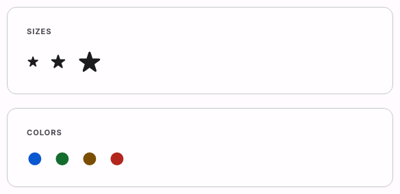

# @lit-material/icon

Material Design 3-styled standalone icon web component built with [Lit](https://lit.dev/). Part of
[lit-material](https://github.com/bohdaq/lit-material).

A consistent sizing/color wrapper for icon content — an inline `<svg>`, an ``, or an
emoji/font-glyph character. Ships no icon set of its own, matching this library's "no icon font"
philosophy: bring whatever icon content you like, this gives it consistent size, color, and
accessibility handling.



## Install

```sh
npm install @lit-material/icon @lit-material/tokens
```

## Usage

```html
<link rel="stylesheet" href="node_modules/@lit-material/tokens/css/index.css" />
<script type="module">
  import "@lit-material/icon";
</script>

<lit-material-icon>
  <svg viewBox="0 0 24 24"><path d="..."></path></svg>
</lit-material-icon>

<lit-material-icon size="large" color="success" label="Verified">✓</lit-material-icon>
```

## API

| Property | Attribute | Type                                                  | Default     |
| -------- | --------- | ------------------------------------------------------ | ----------- |
| `size`   | `size`    | `"small" \| "medium" \| "large"`                        | `"medium"`  |
| `color`  | `color`   | `"inherit" \| "info" \| "success" \| "warning" \| "error"` | `"inherit"` |
| `label`  | `label`   | `string`                                                | `""`        |

Slot: default — the icon content (an `<svg>`, an ``, or a character).

## Behavior

Distinct from `lit-material-icon-button`: that's a clickable button that happens to contain an
icon; this is the icon itself, usable anywhere — inline with text, inside a card, or standing alone
as a status indicator.

Accessibility is decided by whether `label` is set: with one, the icon gets `role="img"` and that
`aria-label` (it's conveying information no text nearby already does — a standalone status icon,
say); without one, it's `aria-hidden="true"`, the common case where the icon is decorative or
redundant with adjacent visible text.

MD3 doesn't define standard color roles for `success`/`warning`/`info` the way it does for `error`
— those three are this component's own CSS custom properties
(`--lit-material-icon-info-color`, etc.), overridable like any other design token.

## License

MIT
