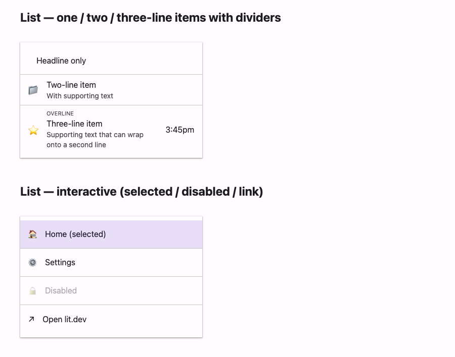

# @lit-material/list

Material Design 3 list web components built with [Lit](https://lit.dev/). Part of
[lit-material](https://github.com/bohdaq/lit-material).



Two elements: `lit-material-list` (a surface container) and `lit-material-list-item` (a row with
overline/headline/supporting-text, leading/trailing content, and optional interactivity).

## Install

```sh
npm install @lit-material/list @lit-material/tokens
```

## Usage

```html
<link rel="stylesheet" href="node_modules/@lit-material/tokens/css/index.css" />
<script type="module">
  import "@lit-material/list";
</script>

<lit-material-list>
  <!-- Static row: one line, no interaction feedback. -->
  <lit-material-list-item divider>Headline only</lit-material-list-item>

  <!-- Two-line, with a leading icon. -->
  <lit-material-list-item divider>
    <span slot="leading" aria-hidden="true">📁</span>
    Headline
    <span slot="supporting-text">Supporting text</span>
  </lit-material-list-item>

  <!-- Three-line, with an overline, leading icon, and trailing text. -->
  <lit-material-list-item interactive>
    <span slot="overline">OVERLINE</span>
    <span slot="leading" aria-hidden="true">⭐</span>
    Headline
    <span slot="supporting-text">Supporting text that can wrap onto a second line</span>
    <span slot="trailing">3:45pm</span>
  </lit-material-list-item>

  <!-- The whole row as a link. -->
  <lit-material-list-item href="https://lit.dev" target="_blank">Open lit.dev</lit-material-list-item>
</lit-material-list>
```

## `lit-material-list` API

Slot: default (`lit-material-list-item` elements, or any other content). No properties — it's a
thin `role="list"` surface wrapper.

## `lit-material-list-item` API

| Property      | Attribute     | Type                               | Default    |
| ------------- | ------------- | ------------------------------------ | ---------- |
| `interactive` | `interactive` | `boolean`                            | `false`    |
| `disabled`    | `disabled`    | `boolean`                            | `false`    |
| `selected`    | `selected`    | `boolean`                            | `false`    |
| `divider`     | `divider`     | `boolean`                            | `false`    |
| `type`        | `type`        | `"button" \| "submit" \| "reset"`    | `"button"` |
| `name`        | `name`        | `string`                              | `""`       |
| `value`       | `value`       | `string`                              | `""`       |
| `form`        | `form`        | `string \| undefined`                 | `undefined`|
| `href`        | `href`        | `string`                              | `""`       |
| `target`      | `target`      | `string`                              | `""`       |

Slots: default (headline), `overline`, `supporting-text`, `leading`, `trailing`. `leading` and
`trailing` accept arbitrary content — an icon, an avatar, an image, a checkbox/switch — and aren't
forced to a fixed size, so size your own slotted content appropriately.

By default a row is a plain, non-interactive container (`role="listitem"`): no hover/press
feedback, no keyboard focus, since it may just be displaying information or hosting its own
interactive controls (e.g. a trailing switch). Set `interactive`, or `href` (which implies it), to
make the *entire row* a single clickable surface instead — it then renders as a real `<button>` or
`<a>` with the same ripple/focus-ring treatment as
[`@lit-material/card`](https://github.com/bohdaq/lit-material/tree/main/packages/card), and
`type="submit"`/`"reset"` participate in an ancestor `<form>` via `ElementInternals`. `selected`
highlights the row (e.g. the current page in a navigation list); `divider` adds a hairline border
below it.

## License

MIT
