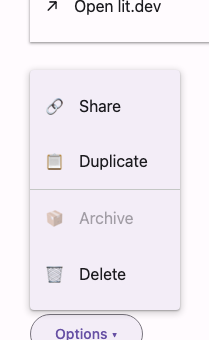

# @lit-material/menu

A Material Design 3 menu web component built with [Lit](https://lit.dev/) on top of the native
[Popover API](https://developer.mozilla.org/en-US/docs/Web/API/Popover_API). Part of
[lit-material](https://github.com/bohdaq/lit-material).



Menu items are just [`@lit-material/list`](https://github.com/bohdaq/lit-material/tree/main/packages/list)'s
`lit-material-list-item` — this package only adds positioning, open/close lifecycle, and keyboard
navigation on top.

## Install

```sh
npm install @lit-material/menu @lit-material/list @lit-material/tokens
```

## Usage

```html
<link rel="stylesheet" href="node_modules/@lit-material/tokens/css/index.css" />
<script type="module">
  import "@lit-material/menu";
  import "@lit-material/list";
</script>

<button id="trigger">Options</button>

<lit-material-menu anchor="trigger">
  <lit-material-list-item interactive>Share</lit-material-list-item>
  <lit-material-list-item interactive>Duplicate</lit-material-list-item>
  <lit-material-list-item interactive disabled>Archive</lit-material-list-item>
  <lit-material-list-item interactive>Delete</lit-material-list-item>
</lit-material-menu>

<script type="module">
  const trigger = document.getElementById("trigger");
  const menu = document.querySelector("lit-material-menu");
  trigger.addEventListener("click", () => menu.show());
</script>
```

Or anchor to an element you don't want to give an id — pass it directly:

```js
menu.show(trigger); // same as menu.anchorElement = trigger; menu.open = true
```

## API

| Property | Attribute | Type      | Default     |
| -------- | --------- | --------- | ----------- |
| `open`   | `open`    | `boolean` | `false`     |
| `anchor` | `anchor`  | `string`  | `undefined` |

| Property/Method            | Description                                                          |
| ---------------------------- | ------------------------------------------------------------------------ |
| `anchorElement` (get/set)    | The element to position against and return focus to. Overrides `anchor` when set directly. |
| `show(anchorElement?)`        | Opens the menu, optionally setting `anchorElement` for this call.        |
| `close()`                     | Closes the menu (`open = false`).                                        |

Built on the native Popover API (`popover="auto"`), so top-layer rendering and light dismiss
(outside click, Escape) come from the browser. Opening the menu focuses the menu itself rather
than the first item, so nothing looks pre-selected — Arrow Down/Up from that neutral state still
land on the first/last item respectively, and continue to move focus among interactive,
non-disabled `lit-material-list-item` children from there (wrapping at the ends); Home/End jump to
the first/last directly. Activating an item (click or Enter/Space on an interactive item) closes
the menu — call `event.stopPropagation()` in your own item click handler if you need a menu that
stays open after an item is activated. A `close` event fires whenever the menu closes, for any
reason.

Because items carry `role="listitem"` (not `menuitem`), the menu itself takes `role="list"` rather
than the ARIA `menu` role — this is a floating, keyboard-navigable list built from
`lit-material-list-item`, not a strict ARIA menu/menuitem widget.

## License

MIT
