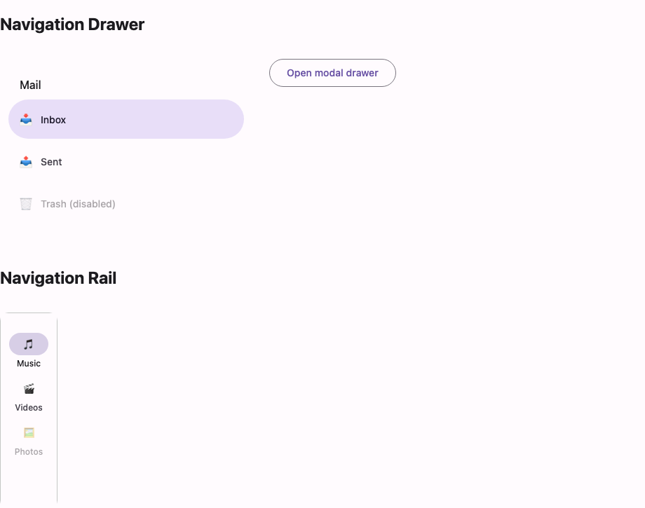

# @lit-material/navigation

Material Design 3 navigation drawer and navigation rail web components built with
[Lit](https://lit.dev/). Part of [lit-material](https://github.com/bohdaq/lit-material).



## Install

```sh
npm install @lit-material/navigation @lit-material/tokens
```

## Usage

```html
<link rel="stylesheet" href="node_modules/@lit-material/tokens/css/index.css" />
<script type="module">
  import "@lit-material/navigation";
</script>

<!-- Navigation drawer: a vertical panel of destinations. -->
<lit-material-navigation-drawer selected="0">
  <lit-material-navigation-drawer-item>
    <svg slot="icon">…</svg>
    Inbox
  </lit-material-navigation-drawer-item>
  <lit-material-navigation-drawer-item>
    <svg slot="icon">…</svg>
    Sent
  </lit-material-navigation-drawer-item>
</lit-material-navigation-drawer>

<!-- Navigation rail: a narrow always-visible bar, typically docked to an edge. -->
<lit-material-navigation-rail selected="0">
  <lit-material-navigation-rail-item>
    <svg slot="icon">…</svg>
    Music
  </lit-material-navigation-rail-item>
  <lit-material-navigation-rail-item>
    <svg slot="icon">…</svg>
    Videos
  </lit-material-navigation-rail-item>
</lit-material-navigation-rail>
```

Listen for `change` to react to the selection:

```js
document.querySelector("lit-material-navigation-drawer").addEventListener("change", (event) => {
  console.log(event.target.selected); // the selected index
});
```

## API

### `lit-material-navigation-drawer`

| Property               | Attribute                | Type                    | Default      |
| ----------------------- | ------------------------ | ------------------------ | ------------ |
| `variant`               | `variant`                | `"standard" \| "modal"`  | `"standard"` |
| `position`              | `position`                | `"start" \| "end"`       | `"start"`    |
| `selected`              | `selected`                | `number`                  | `-1`         |
| `open`                  | `open`                    | `boolean`                 | `false`      |
| `disableBackdropClose`  | `disable-backdrop-close`  | `boolean`                 | `false`      |

`standard` renders as a plain, always-in-flow `<nav>` — a persistent side panel you place in your
own layout. `modal` wraps the same content in a native `<dialog>` (the same foundation
[`@lit-material/dialog`](https://github.com/bohdaq/lit-material/tree/main/packages/dialog) uses),
so the scrim, Escape-to-close, and focus trap all come from the browser; `position` picks which
edge it slides in from. Call `show()`/`close()` (or set `.open`) to control a `modal` drawer.
Fires `cancel`/`close`, re-dispatched from the native `<dialog>` events, for the `modal` variant.

Slots: default (`lit-material-navigation-drawer-item` elements), `header` (a title, a close
button…).

### `lit-material-navigation-drawer-item`

| Property   | Attribute  | Type      | Default |
| ---------- | ---------- | --------- | ------- |
| `selected` | `selected` | `boolean` | `false` |
| `disabled` | `disabled` | `boolean` | `false` |
| `href`     | `href`     | `string`  | `""`    |
| `target`   | `target`   | `string`  | `""`    |

Slots: default (label text), `icon` (leading icon), `badge` (a trailing count or dot).
`selected` is normally managed by the parent drawer, not set directly.

### `lit-material-navigation-rail`

| Property    | Attribute   | Type                            | Default |
| ------------ | ----------- | -------------------------------- | ------- |
| `alignment`  | `alignment` | `"top" \| "center" \| "bottom"` | `"top"` |
| `selected`   | `selected`  | `number`                         | `-1`    |

Slots: default (`lit-material-navigation-rail-item` elements), `fab` (an optional FAB shown above
the items).

### `lit-material-navigation-rail-item`

| Property   | Attribute  | Type      | Default |
| ---------- | ---------- | --------- | ------- |
| `selected` | `selected` | `boolean` | `false` |
| `disabled` | `disabled` | `boolean` | `false` |
| `href`     | `href`     | `string`  | `""`    |
| `target`   | `target`   | `string`  | `""`    |

Slots: default (label text, shown below the icon), `icon`, `badge` (positioned over the icon's
top-right corner). The ripple/focus-ring are scoped to the icon's pill-shaped active indicator,
not the whole item, matching the MD3 spec.

## Behavior

Both `lit-material-navigation-drawer` and `lit-material-navigation-rail` manage selection the
same way `lit-material-tabs` does: set `selected` (an index) to reflect your current route or
section, and each item's own `selected` is kept in sync automatically. Clicking an item updates
`selected` and fires `change` — items don't manage selection themselves, so binding `selected` to
your router state (rather than reading it back out) is the expected integration point for SPA
navigation.

Fully out of scope for this first pass: responsive breakpoint switching (automatically swapping
between rail/drawer/bottom-navigation based on window size) — that's an app-level layout decision
this library doesn't make on your behalf.

## License

MIT
