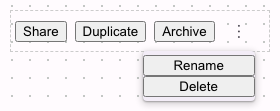

# @lit-material/overflow-menu

Material Design 3-styled overflow menu web component built with [Lit](https://lit.dev/). Part of
[lit-material](https://github.com/bohdaq/lit-material).

A responsive action row: slotted items render inline until they no longer fit the available width,
at which point the excess collapses into a "more" (⋮) kebab menu.



## Install

```sh
npm install @lit-material/overflow-menu @lit-material/tokens
```

## Usage

```html
<link rel="stylesheet" href="node_modules/@lit-material/tokens/css/index.css" />
<script type="module">
  import "@lit-material/overflow-menu";
</script>

<lit-material-overflow-menu style="width: 300px;">
  <button>Share</button>
  <button>Duplicate</button>
  <button>Archive</button>
  <button>Rename</button>
  <button>Delete</button>
</lit-material-overflow-menu>
```

Items are in priority order — the first is kept visible longest, the last overflows first. Give the
element a bounded width (its own, or an ancestor's) for the overflow behavior to have something to
respond to; unconstrained, everything just fits and the kebab button never appears.

## API

| Property | Attribute | Type     | Default          |
| -------- | --------- | -------- | ---------------- |
| `label`  | `label`   | `string` | `"More actions"` |

`label` is the accessible name for the "more" button.

Slot: default — the action items (buttons, links, icon-buttons — any content), in priority order.

Fires `overflow-change` when items move into or out of the overflow menu, with
`detail.overflowing` (the count currently overflowing).

## Behavior

Item widths are measured once — an item already parked in the closed overflow popover has a
zero-size layout box, so it can't be re-measured there — and cached; a `ResizeObserver` on the host
re-runs the fit calculation whenever available width changes, growing the visible row back out as
space returns.

This is a native-`ResizeObserver` "does everything fit?" check, not a full responsive layout engine
— items are assumed to size themselves independently of each other (`flex: none` on every slotted
item).

The "more" menu is a native Popover API (`popover="auto"`) dropdown, positioned and light-dismissed
the same way `lit-material-menu` handles its own.

## License

MIT
