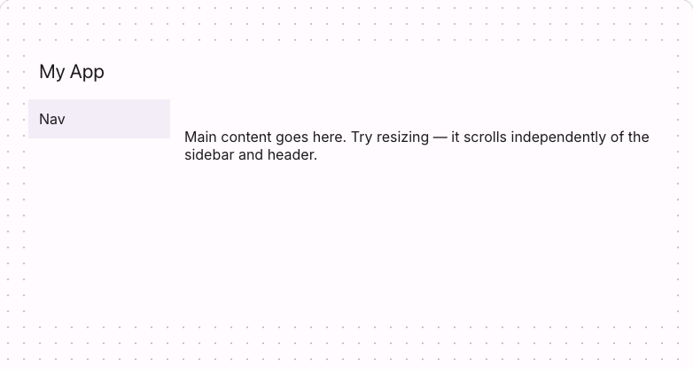

# @lit-material/page

Material Design 3-styled page shell web component built with [Lit](https://lit.dev/). Part of
[lit-material](https://github.com/bohdaq/lit-material).

The outermost app-shell grid: a header row spanning the full width, and a sidebar/main-content row
below it.



## Install

```sh
npm install @lit-material/page @lit-material/tokens
```

## Usage

```html
<link rel="stylesheet" href="node_modules/@lit-material/tokens/css/index.css" />
<script type="module">
  import "@lit-material/page";
  import "@lit-material/top-app-bar";
  import "@lit-material/navigation";
</script>

<lit-material-page style="height: 100vh;">
  <lit-material-top-app-bar slot="header">My App</lit-material-top-app-bar>
  <lit-material-navigation-drawer slot="sidebar">
    <!-- nav items -->
  </lit-material-navigation-drawer>
  <p>Main content goes here.</p>
</lit-material-page>
```

## API

No properties. Slots: `header` (the masthead), `sidebar` (primary navigation), default (the main
content).

## Behavior

A pure layout primitive: it renders whatever's slotted into `header`/`sidebar` — typically
`lit-material-top-app-bar` and `lit-material-navigation-drawer` or `-rail` — without knowing
anything about their specific behavior, so it has no opinion on responsive collapsing, drawer
toggling, or the sidebar's width. That's already each of those components' own responsibility;
duplicating it here would just create two sources of truth.

`main` and `sidebar` scroll independently of each other and of the header, which stays put across
both — the usual app-shell scrolling behavior — with no JavaScript required.

## Scope

Sizing is left to the consumer, the same way `lit-material-top-app-bar` leaves positioning to the
consumer: give `lit-material-page` a height (typically `height: 100vh` on it or an ancestor) for the
scroll regions to have something to scroll within.

## License

MIT
