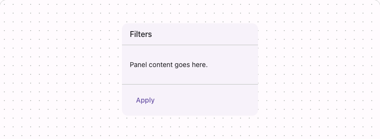

# @lit-material/panel

Material Design 3-styled panel web component built with [Lit](https://lit.dev/). Part of
[lit-material](https://github.com/bohdaq/lit-material).

A generic content container with optional header and footer bands — for grouping related content
distinctly from the page background, without the interactive affordances (hover/press states,
`href`) that `lit-material-card` implies.



## Install

```sh
npm install @lit-material/panel @lit-material/tokens
```

## Usage

```html
<link rel="stylesheet" href="node_modules/@lit-material/tokens/css/index.css" />
<script type="module">
  import "@lit-material/panel";
</script>

<lit-material-panel variant="raised">
  <h3 slot="header">Filters</h3>
  <p>Panel content goes here.</p>
  <div slot="footer">
    <lit-material-button variant="text">Apply</lit-material-button>
  </div>
</lit-material-panel>
```

## API

| Property     | Attribute    | Type                                    | Default     |
| ------------ | ------------ | ---------------------------------------- | ----------- |
| `variant`    | `variant`    | `"default" \| "bordered" \| "raised"`    | `"default"` |
| `scrollable` | `scrollable` | `boolean`                                 | `false`     |

Slots: `header` (optional), default (the body), `footer` (optional).

- `default` — a flat surface-tinted background, no border or shadow.
- `bordered` — a visible outline instead of a tinted background.
- `raised` — adds elevation (shadow).

`scrollable` makes the body scroll internally instead of the whole panel growing — but only does
anything once the panel's own height is constrained by its container (e.g. a CSS grid or flex
cell), since a panel has no opinion of its own about how tall it should be.

## Behavior

The `header`/`footer` slots are `display: contents` — invisible wrappers with no box of their own —
and the visible band (padding, border) is drawn on the slotted element itself via `::slotted(*)`.
Leaving either slot out never leaves a stray empty band, because there's nothing to hide: no element
was slotted in to draw a box around in the first place. This is a pure-CSS approach: no
`slotchange` listener, no state that could flash from empty to populated after hydration in an
SSR-rendered page.

## License

MIT
