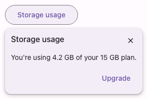

# @lit-material/popover

Material Design 3-styled popover web component built with [Lit](https://lit.dev/). Part of
[lit-material](https://github.com/bohdaq/lit-material).

A richer, click-triggered overlay — a title, body content (arbitrary HTML, not just plain text),
and optional footer actions — anchored to a trigger element. Distinct from
[`@lit-material/tooltip`](https://github.com/bohdaq/lit-material/tree/main/packages/tooltip):
that's hover/focus-triggered, plain text, and never gets a close button or interactive content of
its own.



## Install

```sh
npm install @lit-material/popover @lit-material/tokens
```

## Usage

```html
<link rel="stylesheet" href="node_modules/@lit-material/tokens/css/index.css" />
<script type="module">
  import "@lit-material/popover";
</script>

<lit-material-button id="trigger">Details</lit-material-button>
<lit-material-popover id="popover" anchor="trigger">
  <span slot="header">Storage usage</span>
  You're using 4.2 GB of your 15 GB plan.
  <button slot="footer">Upgrade</button>
</lit-material-popover>

<script type="module">
  document.getElementById("trigger").addEventListener("click", () => {
    document.getElementById("popover").show();
  });
</script>
```

## API

| Property      | Attribute | Type      | Default |
| ------------- | --------- | --------- | ------- |
| `open`        | `open`    | `boolean` | `false` |
| `anchor`      | `anchor`  | `string`  | —       |
| `dismissible` | —         | `boolean` | `true`  |

`anchorElement` (property, not an attribute) — set directly instead of `anchor` when the trigger
isn't reachable by id.

Methods: `show(anchorElement?)`, `close()` — equivalent to setting `.open = true`/`false`;
`show()` optionally updates the anchor at the same time.

Slots: `header` (optional heading, next to the close button — slot exactly one element), default
(body content), `footer` (optional actions — for more than one, wrap them in a single element
yourself so they end up in one row).

Fires `close` after the popover closes, for any reason (the close button, `close()`, Escape, or an
outside click).

## Behavior

Built on the native Popover API (`popover="auto"`, the same foundation `lit-material-menu` uses),
not `<dialog>` — outside-click and Escape light-dismiss come from the browser for free. Opening
focuses the popover itself (not its content), and closing returns focus to the anchor.

Positioning mirrors `lit-material-menu`'s: below the anchor by default, flipping above if there's
no room, clamped horizontally to the viewport.

`role="dialog"` needs an accessible name: `aria-labelledby` is wired up automatically to point at
whatever's slotted into `header`. A popover with no header has no accessible name from this
mechanism — give it one yourself (`aria-label`) if you skip the header slot.

## License

MIT
