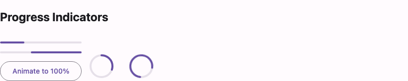

# @lit-material/progress

Material Design 3 linear and circular progress indicator web components built with
[Lit](https://lit.dev/). Part of [lit-material](https://github.com/bohdaq/lit-material).



## Install

```sh
npm install @lit-material/progress @lit-material/tokens
```

## Usage

```html
<link rel="stylesheet" href="node_modules/@lit-material/tokens/css/index.css" />
<script type="module">
  import "@lit-material/progress";
</script>

<lit-material-linear-progress aria-label="Uploading" value="0.4"></lit-material-linear-progress>
<lit-material-linear-progress aria-label="Loading" indeterminate></lit-material-linear-progress>

<lit-material-circular-progress aria-label="Uploading" value="0.4"></lit-material-circular-progress>
<lit-material-circular-progress aria-label="Loading" indeterminate></lit-material-circular-progress>
```

## API

Both elements share the same properties:

| Property        | Attribute        | Type      | Default |
| ---------------- | ----------------- | --------- | ------- |
| `value`          | `value`            | `number`  | `0`     |
| `max`             | `max`              | `number`  | `1`     |
| `indeterminate`   | `indeterminate`    | `boolean` | `false` |

`lit-material-circular-progress` additionally has:

| Property      | Attribute      | Type     | Default |
| -------------- | --------------- | -------- | ------- |
| `size`         | `size`           | `number` | `48`    |
| `strokeWidth`  | `stroke-width`   | `number` | `4`     |

Neither element has a visible label of its own — set `aria-label` or `aria-labelledby` on the
host, same requirement as `lit-material-slider`.

Both are purely presentational: `role="progressbar"` and `aria-value*` are set on the host
itself, so neither depends on `@lit-material/core` (no ripple/focus-ring — there's nothing to
click or focus).

## Behavior

`indeterminate` communicates "in progress, unknown duration": linear shows the classic two-bar
sliding animation; circular shows a fixed-length arc continuously rotating (a deliberate
simplification of the full Material spec animation, which also grows/shrinks the arc as it spins
— documented in the component source). Otherwise, both reflect `value / max` — linear as the
indicator's width, circular as the arc's length via `stroke-dashoffset`. `aria-valuenow` is
omitted entirely while indeterminate, per the WAI-ARIA progressbar pattern.

A buffer/secondary-track variant of linear progress (e.g. video buffering) is a deliberate scope
cut for this first pass.

## License

MIT
