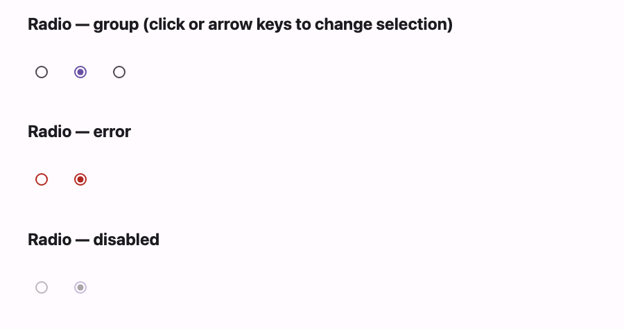

# @lit-material/radio

A Material Design 3 radio button web component built with [Lit](https://lit.dev/). Part of
[lit-material](https://github.com/bohdaq/lit-material).



Grouped single-selection, an error state, roving-tabindex arrow key navigation, and native form
participation.

## Install

```sh
npm install @lit-material/radio @lit-material/tokens
```

## Usage

```html
<link rel="stylesheet" href="node_modules/@lit-material/tokens/css/index.css" />
<script type="module">
  import "@lit-material/radio";
</script>

<lit-material-radio name="size" value="s" aria-label="Small"></lit-material-radio>
<lit-material-radio name="size" value="m" aria-label="Medium" checked></lit-material-radio>
<lit-material-radio name="size" value="l" aria-label="Large"></lit-material-radio>

<lit-material-radio name="plan" value="pro" required error aria-label="Pro plan"></lit-material-radio>
<lit-material-radio name="plan" value="basic" required error aria-label="Basic plan"></lit-material-radio>
```

## API

| Property   | Attribute | Type                 | Default |
| ---------- | --------- | -------------------- | ------- |
| `checked`  | `checked` | `boolean`             | `false` |
| `disabled` | `disabled` | `boolean`            | `false` |
| `error`    | `error`   | `boolean`             | `false` |
| `required` | `required` | `boolean`            | `false` |
| `name`     | `name`    | `string`              | `""`    |
| `value`    | `value`   | `string`              | `"on"`  |
| `form`     | `form`    | `string \| undefined` | `undefined` |

Radios have no visible label, so set `aria-label` or `aria-labelledby`.

Radios sharing the same `name` (and the same owning `<form>`, or none) form a mutually-exclusive
group, same as native `<input type="radio">`: selecting one deselects the rest, only the checked
radio is Tab-reachable, and Arrow Up/Down/Left/Right move and re-select within the group. Only the
checked radio's `value` is submitted; `required` makes the whole group invalid until one member is
checked. Grouping is scoped by JavaScript (not the browser's native radio grouping, which doesn't
span separate shadow roots) — group members are found by querying the light DOM, so keep radios in
the same group out of each other's shadow trees.

## License

MIT
