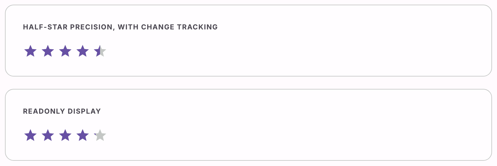

# @lit-material/rating

Material Design 3-styled rating web component built with [Lit](https://lit.dev/). Part of
[lit-material](https://github.com/bohdaq/lit-material).

A row of icons for reading or picking a value — built on a real native `<input type="range">` for
keyboard, pointer dragging, and ARIA slider semantics, the same foundation `lit-material/slider`
uses, with a hover preview of its own on top.



## Install

```sh
npm install @lit-material/rating @lit-material/tokens
```

## Usage

```html
<link rel="stylesheet" href="node_modules/@lit-material/tokens/css/index.css" />
<script type="module">
  import "@lit-material/rating";
</script>

<!-- Interactive: pick a rating. -->
<lit-material-rating label="Rate this product" name="rating"></lit-material-rating>

<!-- Half-star precision. -->
<lit-material-rating precision="0.5" value="3.5"></lit-material-rating>

<!-- Read-only: display an average, not a control. -->
<lit-material-rating value="4.2" readonly label="Average rating"></lit-material-rating>
```

## API

| Property    | Attribute   | Type            | Default   |
| ----------- | ----------- | ---------------- | --------- |
| `value`     | `value`     | `number`         | `0`       |
| `max`       | `max`       | `number`         | `5`       |
| `precision` | `precision` | `1 \| 0.5`         | `1`       |
| `readonly`  | `readonly`  | `boolean`        | `false`   |
| `disabled`  | `disabled`  | `boolean`        | `false`   |
| `name`      | `name`      | `string`         | `""`      |
| `form`      | `form`      | `string \| undefined` | `undefined`|
| `label`     | `label`     | `string`         | `"Rating"`|

Fires `input` live while dragging/pressing a key, and `change` once the value commits — matching
native `<input>` semantics. Form-associated via `ElementInternals` (participates in `FormData`).
`label` is the interactive control's accessible name (there's no visible text label otherwise, so
set something meaningful — "Rate this product," not the default) and, in `readonly` mode, is
prefixed onto the `role="img"` announcement ("Average rating: 4.2 out of 5").

## Behavior

`precision` only constrains what an interactive user can *pick* — it doesn't round `value` for
display, so a readonly rating can show any fraction (a `4.2` average renders a precisely
20%-filled fifth icon) regardless of `precision`.

`readonly` isn't just `disabled` with different styling: a native range input has no "readonly"
concept (only `disabled`, which also mutes it for assistive tech and drops it from the tab order),
which isn't what "display a fixed rating" wants. So `readonly` skips the native input entirely and
renders a plain, non-interactive `role="img"` display instead — still perceivable and labeled,
just not a control. `disabled` behaves like every other form control here: non-interactive *and*
visually dimmed.

Hovering (or dragging a finger across, on touch) previews what clicking would set, snapped to
`precision` — purely a visual fill computed from pointer position; the committed `value` only ever
changes through the native input's own `input`/`change` events, so the preview can never drift out
of sync with what would actually get committed.

## Scope

A fixed star icon — no per-instance custom icon (heart, thumbs-up, ...) support. Override
`--lit-material-rating-icon-color`/`--lit-material-rating-icon-empty-color`/
`--lit-material-rating-icon-size` (CSS custom properties) for a different look within the star
shape itself.

## License

MIT
