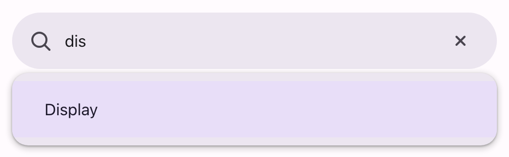

# @lit-material/search

Material Design 3 search bar and (docked) search view web components built with
[Lit](https://lit.dev/), the latter on top of the native
[Popover API](https://developer.mozilla.org/en-US/docs/Web/API/Popover_API). Part of
[lit-material](https://github.com/bohdaq/lit-material).



Search suggestions are just [`@lit-material/list`](https://github.com/bohdaq/lit-material/tree/main/packages/list)'s
`lit-material-list-item` — this package only adds the pill-shaped input and, for the view,
positioning, open/close lifecycle, and a highlight-and-activate keyboard model built for a text
input rather than a button (see Behavior below).

## Install

```sh
npm install @lit-material/search @lit-material/list @lit-material/tokens
```

## Usage

```html
<link rel="stylesheet" href="node_modules/@lit-material/tokens/css/index.css" />
<script type="module">
  import "@lit-material/search";
  import "@lit-material/list";
</script>

<lit-material-search-bar id="bar" placeholder="Search settings"></lit-material-search-bar>

<lit-material-search-view id="view" anchor="bar">
  <lit-material-list-item interactive>Wi-Fi</lit-material-list-item>
  <lit-material-list-item interactive>Bluetooth</lit-material-list-item>
  <lit-material-list-item interactive>Display</lit-material-list-item>
</lit-material-search-view>

<script type="module">
  const bar = document.getElementById("bar");
  const view = document.getElementById("view");

  // The view opens on its own when the bar is focused — this just wires up
  // what a suggestion actually does, and filtering as the user types.
  view.addEventListener("click", (event) => {
    const item = event.target.closest("lit-material-list-item");
    if (item) bar.value = item.textContent.trim();
  });
  bar.addEventListener("input", () => {
    for (const item of view.querySelectorAll("lit-material-list-item")) {
      item.hidden = !item.textContent.toLowerCase().includes(bar.value.toLowerCase());
    }
  });
</script>
```

## API

### `lit-material-search-bar`

| Property      | Attribute     | Type      | Default     |
| -------------- | -------------- | --------- | ----------- |
| `value`        | `value`        | `string`  | `""`        |
| `placeholder`  | `placeholder`  | `string`  | `"Search"`  |
| `label`        | `label`        | `string`  | `""`        |
| `disabled`     | `disabled`     | `boolean` | `false`     |

`label` sets the input's accessible name when `placeholder` alone isn't descriptive enough;
otherwise the placeholder itself is used. `focus()` delegates to the underlying `<input>`.

Slots: `leading-icon` (defaults to a magnifying-glass icon — override with a back arrow or menu
icon), `trailing` (an avatar, extra icon buttons…, shown after the clear button).

Fires `input` whenever `value` changes (typing or the clear button, which only renders while
`value` is non-empty) and `search` when Enter is pressed in the field.

### `lit-material-search-view`

| Property | Attribute | Type      | Default     |
| -------- | --------- | --------- | ----------- |
| `open`   | `open`    | `boolean` | `false`     |
| `anchor` | `anchor`  | `string`  | `undefined` |

| Property/Method            | Description                                                          |
| ---------------------------- | ------------------------------------------------------------------------ |
| `anchorElement` (get/set)    | The search bar (or any element) to position against and bind to. Overrides `anchor` when set directly. |
| `show(anchorElement?)`        | Opens the view, optionally setting `anchorElement` for this call.        |
| `close()`                     | Closes the view (`open = false`).                                        |

Built on the native Popover API (`popover="manual"`, so top-layer rendering escapes clipping/
overflow ancestors), but — unlike `lit-material-menu`'s `"auto"` — outside-click and Escape
dismissal are handled by this component itself rather than the browser's own light-dismiss (see
Behavior below for why). Fires `close` whenever the view closes, for any reason.

## Behavior

Unlike [`@lit-material/menu`](https://github.com/bohdaq/lit-material/tree/main/packages/menu),
`lit-material-search-view` doesn't wait for a `show()` call — like
[`@lit-material/tooltip`](https://github.com/bohdaq/lit-material/tree/main/packages/tooltip), it
binds its own `focus` listener to whatever `anchorElement` resolves to and opens itself
automatically, since a search view is meant to appear the moment its bar is interacted with. It
also stretches to the anchor's width rather than sizing to its own content.

This is also why it's a `manual`, not `auto`, popover: an `auto` popover's native light-dismiss
would hide it the instant it opens here, because the very click that focuses the anchor (and
triggers this auto-open) isn't a native `popovertarget` invoker relationship the browser
recognizes as legitimate. So this component dismisses itself on an outside click and, via the
same keydown handling described below, on Escape.

Because the anchor is a text input the user keeps typing into (not a button, unlike a menu's
trigger), the view never moves real DOM focus into itself. Arrow Down/Up instead move a
*highlighted* suggestion — reusing `lit-material-list-item`'s own `selected` property, which also
gives it the same visual treatment as a selected item elsewhere — wrapping at the ends and
skipping disabled items; Enter activates the highlighted item (a real `.click()`, so it runs
whatever click handling that item already has); Escape closes the view. Activating an item by
click, same as `lit-material-menu`, closes the view.

## Scope

Deliberately out of scope for this first pass, all reasonable follow-ups rather than silently
missing pieces:

- Filtering/matching suggestions against the typed value — left entirely to your own `input`
  listener (see Usage above), the same way this library never bakes in data-fetching or search
  logic anywhere else.
- The MD3 full-screen search view (a takeover with its own back-button header) — this is the
  docked variant only, a dropdown panel below the bar.
- Recent-searches persistence and suggestion grouping/sections — application concerns, not this
  component's.

## License

MIT
