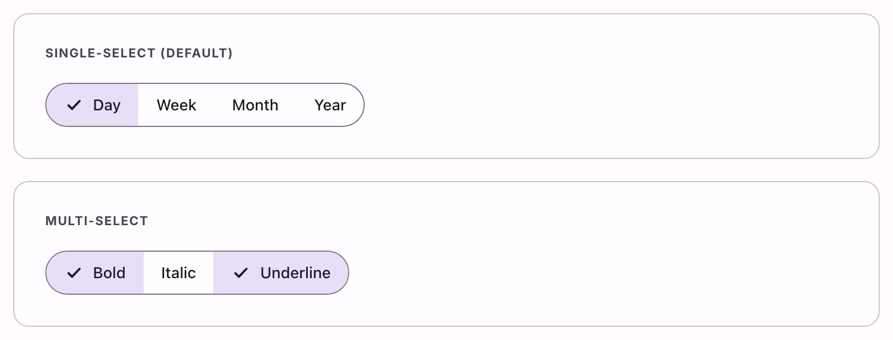

# @lit-material/segmented-button

A Material Design 3 segmented button web component built with [Lit](https://lit.dev/). Part of
[lit-material](https://github.com/bohdaq/lit-material).



## Install

```sh
npm install @lit-material/segmented-button @lit-material/tokens
```

## Usage

```html
<link rel="stylesheet" href="node_modules/@lit-material/tokens/css/index.css" />
<script type="module">
  import "@lit-material/segmented-button";
</script>

<!-- Single-select (default): exactly one segment selected at a time, like a radio group. -->
<lit-material-segmented-button-group>
  <lit-material-segmented-button selected>Day</lit-material-segmented-button>
  <lit-material-segmented-button>Week</lit-material-segmented-button>
  <lit-material-segmented-button>Month</lit-material-segmented-button>
</lit-material-segmented-button-group>

<!-- Multi-select: any number of segments selected independently, like a group of checkboxes. -->
<lit-material-segmented-button-group multiselect>
  <lit-material-segmented-button selected>Bold</lit-material-segmented-button>
  <lit-material-segmented-button>Italic</lit-material-segmented-button>
  <lit-material-segmented-button selected>Underline</lit-material-segmented-button>
</lit-material-segmented-button-group>
```

Listen for `change` to react to the selection:

```js
document.querySelector("lit-material-segmented-button-group").addEventListener("change", (event) => {
  const group = event.currentTarget;
  const selected = [...group.querySelectorAll("lit-material-segmented-button")].filter((b) => b.selected);
  console.log(selected.map((b) => b.textContent));
});
```

## API

### `lit-material-segmented-button-group`

| Property      | Attribute     | Type      | Default |
| ------------- | ------------- | --------- | ------- |
| `multiselect` | `multiselect` | `boolean` | `false` |

`false` (default): radio-like — selecting a segment deselects the others, and clicking the
already-selected segment is a no-op (it doesn't deselect). `true`: checkbox-like — clicking any
segment toggles its own `selected` independently, so any number (including zero) can end up
selected.

Fires `change` (bubbling) when a segment's selected state changes via user interaction — not when
`selected` is set programmatically on a segment.

### `lit-material-segmented-button`

| Property   | Attribute  | Type      | Default |
| ---------- | ---------- | --------- | ------- |
| `selected` | `selected` | `boolean` | `false` |
| `disabled` | `disabled` | `boolean` | `false` |

`selected` is managed by the parent group — don't set it directly on a segment you mount inside
one (setting it in markup for the initial state, as in the examples above, is fine — the group
reads it on connect). An optional `icon` slot renders before the label; it's ignored (a checkmark
takes its place) while the segment is selected, the same swap `lit-material-chip`'s `filter`
variant makes. A default slot holds the label text.

```html
<lit-material-segmented-button>
  <svg slot="icon">…</svg>
  Grid view
</lit-material-segmented-button>
```

## Behavior

Selection is entirely driven by the group, the same way `lit-material-tabs` drives its tabs: a
segment has no click handler of its own — the group listens for the bubbling click and mutates the
target segment's `selected` (and, in single-select mode, clears the others) from there.

Keyboard support follows the [WAI-ARIA toolbar pattern](https://www.w3.org/WAI/ARIA/apg/patterns/toolbar/)
rather than tabs' automatic-activation model: `ArrowLeft`/`ArrowRight` move a roving tabindex
between enabled segments (wrapping at the ends, skipping disabled ones) without selecting them;
`Home`/`End` jump to the first/last enabled segment. Because segments are real `<button>`s,
Enter/Space already activates whichever one currently has focus — no extra keydown handling is
needed for that part. Only one segment is ever in the tab order at a time (the selected one, if
any, else the first enabled one).

## License

MIT
