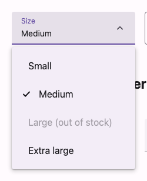

# @lit-material/select

Material Design 3 select web components built with [Lit](https://lit.dev/). Part of
[lit-material](https://github.com/bohdaq/lit-material).

Two elements: `lit-material-select` (a button that opens a popup listbox) and
`lit-material-select-option` (a single option) — following the WAI-ARIA
["select-only combobox"](https://www.w3.org/WAI/ARIA/apg/patterns/combobox/examples/combobox-select-only/) pattern.



## Install

```sh
npm install @lit-material/select @lit-material/tokens
```

## Usage

```html
<link rel="stylesheet" href="node_modules/@lit-material/tokens/css/index.css" />
<script type="module">
  import "@lit-material/select";
</script>

<lit-material-select name="size" label="Size" required>
  <lit-material-select-option value="s">Small</lit-material-select-option>
  <lit-material-select-option value="m">Medium</lit-material-select-option>
  <lit-material-select-option value="l" disabled>Large (out of stock)</lit-material-select-option>
  <lit-material-select-option value="xl">Extra large</lit-material-select-option>
</lit-material-select>
```

## `lit-material-select` API

| Property         | Attribute        | Type                    | Default    |
| ----------------- | ----------------- | ------------------------- | ---------- |
| `variant`        | `variant`        | `"filled" \| "outlined"`  | `"filled"` |
| `label`          | `label`          | `string`                  | `""`       |
| `value`          | `value`          | `string`                  | `""`       |
| `name`           | `name`           | `string`                  | `""`       |
| `required`       | `required`       | `boolean`                 | `false`    |
| `disabled`       | `disabled`       | `boolean`                 | `false`    |
| `error`          | `error`          | `boolean`                 | `false`    |
| `errorText`      | `error-text`     | `string`                  | `""`       |
| `supportingText` | `supporting-text`| `string`                  | `""`       |
| `open`           | `open`           | `boolean`                 | `false`    |
| `form`           | `form`           | `string \| undefined`     | `undefined`|

Slot: default (`lit-material-select-option` elements). Form-associated via `ElementInternals`
(participates in `FormData`, validation, and form reset); `required` makes an empty selection
invalid.

## `lit-material-select-option` API

| Property   | Attribute  | Type      | Default |
| ---------- | ---------- | --------- | ------- |
| `value`    | `value`    | `string`  | `""`    |
| `selected` | `selected` | `boolean` | `false` (managed by the parent select) |
| `disabled` | `disabled` | `boolean` | `false` |

Slot: default (label), `leading` (an optional icon, replaced by a checkmark when `selected`).

## Keyboard interaction

Matches the WAI-ARIA select-only combobox pattern: Enter/Space/Arrow Down/Home on the closed
trigger open the listbox (highlighting the current selection, or the first option); Arrow Up
opens it highlighting the last. Once open, Arrow Up/Down move the highlight (no wrapping, skipping
disabled options), Home/End jump to the first/last, Enter/Space accept the highlighted option and
return focus to the trigger, Escape closes without changing the value, and Tab accepts the
highlighted option and moves focus onward (not back to the trigger) — all per the APG pattern.
Clicking an option selects it directly; clicking outside the open listbox closes it without
changing the value.

The APG reference pattern tracks the highlighted option via `aria-activedescendant` (an ID
reference). That doesn't work here: the trigger lives in the select's shadow root and each option
is its own separate shadow root, and ARIA ID references generally don't cross shadow-DOM
boundaries. This uses the APG's sanctioned alternative instead — real roving `tabindex`/`focus()`
among options, the same technique `lit-material-radio` and `lit-material-menu` already use.

## License

MIT
