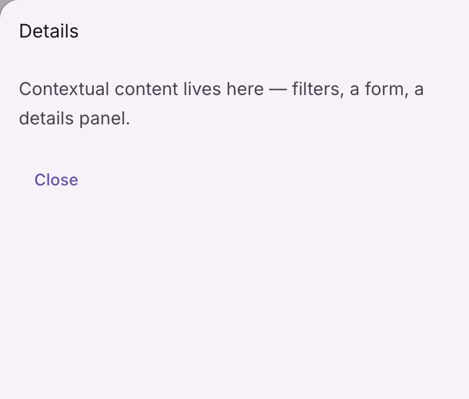
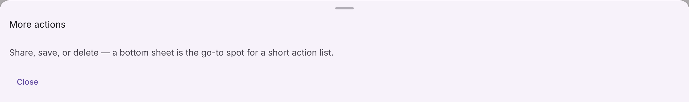

# @lit-material/sheet

Material Design 3 side sheet and bottom sheet web components built with [Lit](https://lit.dev/),
on the same native-`<dialog>` foundation as
[`@lit-material/dialog`](https://github.com/bohdaq/lit-material/tree/main/packages/dialog) and
[`@lit-material/navigation`](https://github.com/bohdaq/lit-material/tree/main/packages/navigation)'s
navigation drawer. Part of [lit-material](https://github.com/bohdaq/lit-material).




## Install

```sh
npm install @lit-material/sheet @lit-material/tokens
```

## Usage

```html
<link rel="stylesheet" href="node_modules/@lit-material/tokens/css/index.css" />
<script type="module">
  import "@lit-material/sheet";
</script>

<!-- Side sheet: a vertical panel of supplementary content. -->
<lit-material-button id="open-side-sheet">Details</lit-material-button>
<lit-material-side-sheet id="details" variant="modal">
  <span slot="header">Details</span>
  <p>Contextual content, filters, a form…</p>
</lit-material-side-sheet>

<!-- Bottom sheet: a full-width panel anchored to the bottom edge. -->
<lit-material-button id="open-bottom-sheet">More actions</lit-material-button>
<lit-material-bottom-sheet id="actions">
  <span slot="header">More actions</span>
  <p>Share, save, delete…</p>
</lit-material-bottom-sheet>

<script type="module">
  document.getElementById("open-side-sheet").addEventListener("click", () => {
    document.getElementById("details").show();
  });
  document.getElementById("open-bottom-sheet").addEventListener("click", () => {
    document.getElementById("actions").show();
  });
</script>
```

## API

### `lit-material-side-sheet`

| Property                | Attribute                | Type                    | Default |
| ------------------------ | ------------------------ | ------------------------ | ------- |
| `variant`                | `variant`                 | `"standard" \| "modal"`  | `"standard"` |
| `position`                | `position`                 | `"start" \| "end"`      | `"end"` |
| `open`                    | `open`                     | `boolean`                 | `false` |
| `disableBackdropClose`    | `disable-backdrop-close`  | `boolean`                 | `false` |

`standard` renders as a plain, always-in-flow container you place in your own layout. `modal`
wraps the same content in a native `<dialog>`, so the scrim, Escape-to-close, and focus trap all
come from the browser; `position` picks which edge it slides in from — `"end"` (the right, in
LTR) by default, since a side sheet is typically evoked alongside primary navigation anchored to
`"start"`, not on top of it.

Slots: default (the sheet's content), `header` (a title, a close button…).

### `lit-material-bottom-sheet`

| Property                | Attribute                | Type                    | Default    |
| ------------------------ | ------------------------ | ------------------------ | ---------- |
| `variant`                | `variant`                 | `"standard" \| "modal"`  | `"modal"`  |
| `open`                    | `open`                     | `boolean`                 | `false`    |
| `disableBackdropClose`    | `disable-backdrop-close`  | `boolean`                 | `false`    |
| `showDragHandle`          | `show-drag-handle`         | `boolean`                 | `true`     |

Same `standard`/`modal` split, anchored to the bottom edge instead — `modal` is the default here,
since a bottom sheet is far more commonly a temporary, dismissible surface than a persistent one
(unlike a side sheet or navigation drawer). `showDragHandle` shows a small decorative handle bar
at the top; see Scope below for what it doesn't do.

Slots: default (the sheet's content), `header` (a title, a close button…), below the drag handle.

### Both components

| Method    | Description                                                                      |
| ---------- | ---------------------------------------------------------------------------------- |
| `show()`   | Opens a `modal` sheet. Equivalent to setting `.open = true`. No visible effect for `standard`. |
| `close()`  | Closes a `modal` sheet. Equivalent to setting `.open = false`. No visible effect for `standard`. |

Fires `cancel`/`close`, re-dispatched from the native `<dialog>` events (Escape, a backdrop click,
or your own `close()` call all land here), for the `modal` variant — same as
`@lit-material/dialog` and `@lit-material/navigation`'s navigation drawer re-dispatch their own.

## Scope

Deliberately out of scope for this first pass, all reasonable follow-ups rather than silently
missing pieces:

- Drag-to-dismiss (and, for a bottom sheet, drag-to-resize) — the drag handle bar is purely
  decorative. Both sheets are dismissed the same way `@lit-material/dialog` is: Escape, a backdrop
  click, or your own `close()` call.
- A slide-in/out entrance or exit *animation* — like `@lit-material/navigation`'s modal drawer,
  the native `<dialog>` just appears/disappears; there's no transition on top of it.
- Responsive breakpoint switching (e.g. automatically becoming a bottom sheet on narrow viewports
  and a side sheet on wide ones) — an app-level layout decision this library doesn't make on your
  behalf, the same scope cut `@lit-material/navigation` documents for its own three surfaces.

## License

MIT
