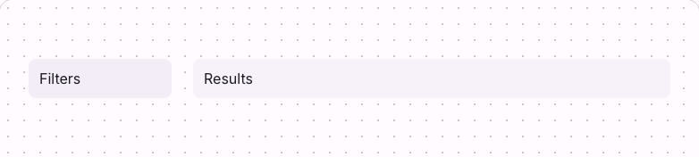

# @lit-material/sidebar

Material Design 3-styled sidebar layout web component built with [Lit](https://lit.dev/). Part of
[lit-material](https://github.com/bohdaq/lit-material).

A two-pane layout — a fixed-width side panel next to flexible main content — for things like a
filter panel beside a list.



## Install

```sh
npm install @lit-material/sidebar @lit-material/tokens
```

## Usage

```html
<link rel="stylesheet" href="node_modules/@lit-material/tokens/css/index.css" />
<script type="module">
  import "@lit-material/sidebar";
</script>

<lit-material-sidebar panel-width="16rem">
  <nav slot="panel">Filters go here.</nav>
  <div>Results go here.</div>
</lit-material-sidebar>
```

## API

| Property     | Attribute      | Type              | Default   |
| ------------ | -------------- | ----------------- | --------- |
| `position`   | `position`     | `"start" \| "end"` | `"start"` |
| `panelWidth` | `panel-width`  | `string`           | `"20rem"` |

Slots: `panel` (the narrower side content), default (the main content). `position` chooses which
side the panel sits on before stacking; `panelWidth` accepts any valid CSS length and only takes
effect above the stacking breakpoint — below it, both panes take the full available width.

## Behavior

Distinct from `lit-material-navigation`'s drawer/rail: those are app-level navigation chrome with
their own responsive/modal behavior; this is a general two-column content layout primitive with
none of that.

Stacks to a single column via a `@container` query on its own inline size (at 640px), not a
`@media` viewport query — so it collapses correctly regardless of where it's nested. A sidebar
embedded in a narrow column of an otherwise-wide page still stacks, which a viewport-based
breakpoint would get wrong.

## License

MIT
