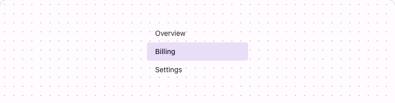

# @lit-material/simple-list

Material Design 3-styled simple list web components built with [Lit](https://lit.dev/). Part of
[lit-material](https://github.com/bohdaq/lit-material).

A plain, lightweight list of links or buttons — an in-page table of contents, a settings nav — with
none of `@lit-material/list`'s ripple, focus-ring, or leading/trailing-icon richness.



## Install

```sh
npm install @lit-material/simple-list @lit-material/tokens
```

## Usage

```html
<link rel="stylesheet" href="node_modules/@lit-material/tokens/css/index.css" />
<script type="module">
  import "@lit-material/simple-list";
</script>

<lit-material-simple-list>
  <lit-material-simple-list-item href="#overview">Overview</lit-material-simple-list-item>
  <lit-material-simple-list-item href="#billing" current>Billing</lit-material-simple-list-item>
  <lit-material-simple-list-item href="#settings">Settings</lit-material-simple-list-item>
</lit-material-simple-list>
```

## API

| Property   | Attribute  | Type      | Default |
| ---------- | ---------- | --------- | ------- |
| `href`     | `href`     | `string`  | `""`    |
| `current`  | `current`  | `boolean` | `false` |
| `disabled` | `disabled` | `boolean` | `false` |

Slot: default (the item's label). A real `<a href>` when `href` is set (and not `disabled`); a
`<button>` otherwise, for a JS-driven selection without navigation.

## Behavior

Real interactive elements (`<a>`/`<button>`) mean Tab and Enter already work natively, so — like
`lit-material-breadcrumb-item` — there's no roving-tabindex or arrow-key-navigation logic here at
all: reach for `lit-material-list` or `lit-material-tree` instead if you need that
composite-widget behavior.

`current` is purely presentational: unlike `lit-material-tabs`, this component doesn't enforce
single-selection across siblings — set/clear it yourself on whichever items should be highlighted.

## License

MIT
