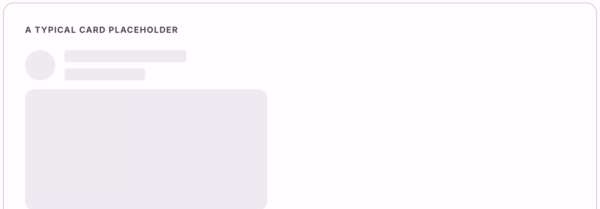

# @lit-material/skeleton

Material Design 3-styled loading-placeholder web component built with [Lit](https://lit.dev/). Part
of [lit-material](https://github.com/bohdaq/lit-material).

A plain, animated (or static) block standing in for content that hasn't arrived yet.



## Install

```sh
npm install @lit-material/skeleton @lit-material/tokens
```

## Usage

```html
<link rel="stylesheet" href="node_modules/@lit-material/tokens/css/index.css" />
<script type="module">
  import "@lit-material/skeleton";
</script>

<lit-material-skeleton></lit-material-skeleton>
<lit-material-skeleton variant="circular"></lit-material-skeleton>
<lit-material-skeleton variant="rectangular" height="200px"></lit-material-skeleton>
```

## API

| Property    | Attribute   | Type                                                    | Default  |
| ----------- | ----------- | -------------------------------------------------------- | -------- |
| `variant`   | `variant`   | `"text" \| "circular" \| "rectangular" \| "rounded"`        | `"text"` |
| `animation` | `animation` | `"pulse" \| "wave" \| "none"`                              | `"pulse"`|
| `width`     | `width`     | `string` (any CSS length)                                 | `""`     |
| `height`    | `height`    | `string` (any CSS length)                                 | `""`     |

Each `variant` has a sensible default size when `width`/`height` are left unset: `text` is `100%`
wide and `1em` tall (so it scales with the surrounding text's line-height); `circular` is a fixed
40px circle; `rectangular`/`rounded` are `100%` wide and 120px tall. Set `width`/`height` explicitly
to override either.

That `100%` default is relative to the element's own containing block, like any other block-level
element — inside a flex or grid container that doesn't stretch its items (e.g. `align-items:
center`), it'll shrink to zero instead, the same as a plain `<div>` would. Give the skeleton (or a
wrapping element) an explicit `width` in that case.

## Behavior

Purely decorative — the placeholder itself is `aria-hidden`, since a screen reader announcing a
shape that's about to disappear isn't useful. If your UI needs to *tell* assistive tech that
something is loading, put `aria-busy="true"` (and, if relevant, an `aria-live` region for the
eventual result) on your own container — that's a statement about your page's state, not something
this element can make on your behalf.

## License

MIT
