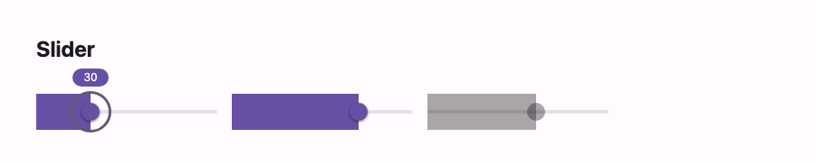

# @lit-material/slider

A Material Design 3 slider web component built with [Lit](https://lit.dev/). Part of
[lit-material](https://github.com/bohdaq/lit-material).



## Install

```sh
npm install @lit-material/slider @lit-material/tokens
```

## Usage

```html
<link rel="stylesheet" href="node_modules/@lit-material/tokens/css/index.css" />
<script type="module">
  import "@lit-material/slider";
</script>

<lit-material-slider aria-label="Volume" min="0" max="100" step="1" value="30"></lit-material-slider>
```

## API

| Property   | Attribute | Type                  | Default |
| ---------- | --------- | ----------------------- | ------- |
| `min`      | `min`     | `number`                | `0`     |
| `max`      | `max`     | `number`                | `100`   |
| `step`     | `step`    | `number`                | `1`     |
| `value`    | `value`   | `number`                | `0`     |
| `disabled` | `disabled`| `boolean`               | `false` |
| `name`     | `name`    | `string`                | `""`    |
| `form`     | `form`    | `string \| undefined`    | `undefined` |

Sliders have no visible label, so set `aria-label` or `aria-labelledby`.

Built on a real native `<input type="range">` for keyboard interaction (arrow keys, Home/End,
Page Up/Down), pointer dragging, value clamping/stepping, and ARIA slider semantics — styled
invisibly on top of custom track/thumb visuals, the same pattern
[`@lit-material/checkbox`](https://github.com/bohdaq/lit-material/tree/main/packages/checkbox)/`radio`/`switch`
use. A value bubble appears above the thumb while focused or dragging. `input` fires live as the
value changes; `change` fires once the change is committed (both matching native `<input>`
semantics). Form-associated via `ElementInternals` (participates in `FormData`).

Single-value only — a two-thumb range slider is a deliberate scope cut for this first pass.

## License

MIT
