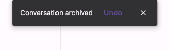

# @lit-material/snackbar

A Material Design 3 snackbar web component built with [Lit](https://lit.dev/) on top of the native
[Popover API](https://developer.mozilla.org/en-US/docs/Web/API/Popover_API) (`popover="manual"`).
Part of [lit-material](https://github.com/bohdaq/lit-material).



## Install

```sh
npm install @lit-material/snackbar @lit-material/tokens
```

## Usage

```html
<link rel="stylesheet" href="node_modules/@lit-material/tokens/css/index.css" />
<script type="module">
  import "@lit-material/snackbar";
</script>

<lit-material-snackbar id="toast">Message sent</lit-material-snackbar>

<lit-material-snackbar id="undo-toast" closable duration="8000">
  Conversation archived
  <lit-material-button slot="action" variant="text" id="undo-btn">Undo</lit-material-button>
</lit-material-snackbar>

<script type="module">
  document.getElementById("undo-btn").addEventListener("click", () => {
    // Your own undo logic — runs before the snackbar closes itself.
  });
  document.getElementById("toast").show();
</script>
```

Only one snackbar is meant to be visible at a time. For a queue of messages, reuse a single
instance — update its slotted content, then call `show()` again — rather than stacking multiple
instances.

## API

| Property    | Attribute   | Type      | Default |
| ------------ | ------------ | --------- | ------- |
| `open`       | `open`       | `boolean` | `false` |
| `duration`   | `duration`   | `number`  | `5000`  |
| `closable`   | `closable`   | `boolean` | `false` |

| Method   | Description                                                        |
| -------- | --------------------------------------------------------------------- |
| `show()` | Opens the snackbar (`open = true`) and (re)starts its auto-dismiss timer. |
| `close()` | Closes the snackbar (`open = false`).                                  |

Slots: default (message text), `action` (an optional action element, e.g.
`lit-material-button variant="text"` — activating it closes the snackbar, same as `closable`'s
dismiss button).

Built on the native Popover API in `manual` mode — top-layer rendering without any of `auto`
mode's automatic dismissal, since a snackbar shouldn't disappear just because the user clicked
elsewhere on the page. Unlike `lit-material-dialog`/`lit-material-menu`, opening a snackbar never
steals focus — it's a passive notification. Hovering or focusing it pauses the auto-dismiss timer
(set `duration="0"` to disable auto-dismiss entirely); a `close` event fires whenever it closes,
for any reason. `role="status"`/`aria-live="polite"` make it an accessible live region.

## License

MIT
