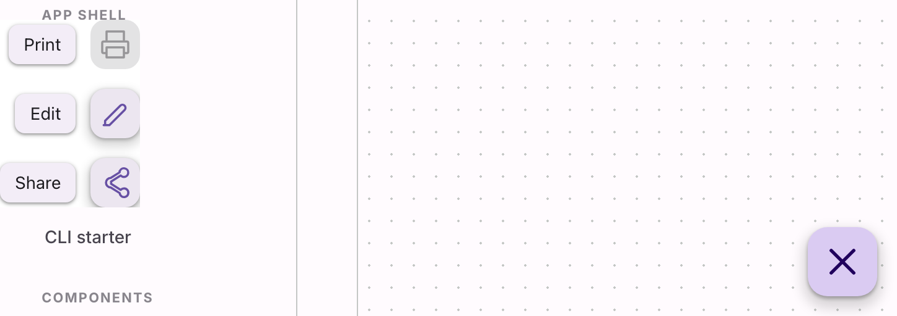

# @lit-material/speed-dial

Material Design 3-styled speed dial web components built with [Lit](https://lit.dev/). Part of
[lit-material](https://github.com/bohdaq/lit-material).

A FAB that expands into a column of `lit-material-speed-dial-action` items — built on the native
Popover API for the actions list (top-layer rendering, light dismiss on outside click/Escape all
come from the browser), the same foundation [`@lit-material/menu`](../menu) uses.



## Install

```sh
npm install @lit-material/speed-dial @lit-material/tokens
```

## Usage

```html
<link rel="stylesheet" href="node_modules/@lit-material/tokens/css/index.css" />
<script type="module">
  import "@lit-material/speed-dial";
</script>

<lit-material-speed-dial label="Actions">
  <svg slot="icon" viewBox="0 0 24 24"><path d="M12 5v14M5 12h14" /></svg>
  <lit-material-speed-dial-action label="Share">
    <svg slot="icon" viewBox="0 0 24 24">...</svg>
  </lit-material-speed-dial-action>
  <lit-material-speed-dial-action label="Print">
    <svg slot="icon" viewBox="0 0 24 24">...</svg>
  </lit-material-speed-dial-action>
</lit-material-speed-dial>
```

The trigger's slotted icon rotates 45° while open — the classic "+" becoming "×" — a purely visual
CSS transform, so it only reads well if your icon actually looks like a "+" (as in the example
above).

## `lit-material-speed-dial` API

| Property    | Attribute   | Type            | Default   |
| ----------- | ----------- | ---------------- | --------- |
| `open`      | `open`      | `boolean`        | `false`   |
| `direction` | `direction` | `"up" \| "down"`  | `"up"`    |
| `disabled`  | `disabled`  | `boolean`        | `false`   |
| `label`     | `label`     | `string`         | `"Actions"`|

Slots: `icon` (the trigger's icon), default (`lit-material-speed-dial-action` elements, closest to
the trigger first). Fires `close` when the speed dial closes, for any reason (an action's
activation, `close()`, Escape, or an outside click). `show()`/`close()` methods are also available
for programmatic control.

Only vertical fanning (`direction="up"`/`"down"`) is supported — the overwhelmingly common
placement (corner-anchored FAB, actions fanning toward the free vertical space) — not the
four-directional fan some older Material speed-dial implementations offered.

## `lit-material-speed-dial-action` API

| Property   | Attribute  | Type      | Default |
| ---------- | ---------- | --------- | ------- |
| `disabled` | `disabled` | `boolean` | `false` |
| `label`    | `label`    | `string`  | `""`    |

Slots: `icon`, `label` (an optional visible label pill beside the icon). `label` doubles as the
pill's fallback text and the button's accessible name — the pill itself is always `aria-hidden` so
the two never get announced separately. Set `label` even if you slot custom rich content into
`label` — otherwise the button has no accessible name at all.

## Keyboard interaction

Up/Down (matched to `direction`, so pressing "into the fan" always means the same physical
direction as the visual fan) move a roving focus from the trigger into the actions and back,
wrapping neither past the trigger nor past the last action. Home/End jump to the first/last enabled
action. Enter/Space activate whatever's focused (native button semantics, no custom handling
needed). Escape closes and returns focus to the trigger, same as clicking an action does.

## Scope

No four-directional fan (left/right), matching MD3's own move away from the older multi-direction
speed dial. No per-instance custom trigger-icon-morph beyond the 45° rotation — if "+" becoming "×"
doesn't fit your icon, override `slot="icon"` yourself when `open` changes instead.

## License

MIT
