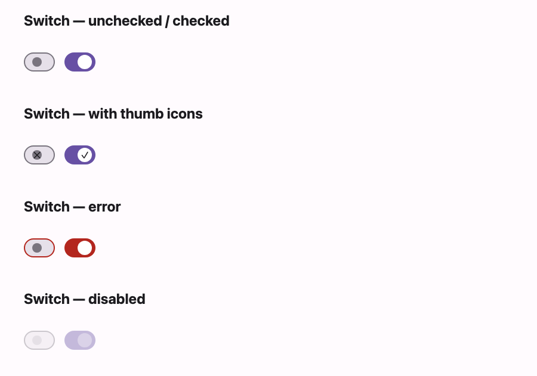

# @lit-material/switch

A Material Design 3 switch web component built with [Lit](https://lit.dev/). Part of
[lit-material](https://github.com/bohdaq/lit-material).



An on/off toggle with optional thumb icons, an error state, and native form participation.

## Install

```sh
npm install @lit-material/switch @lit-material/tokens
```

## Usage

```html
<link rel="stylesheet" href="node_modules/@lit-material/tokens/css/index.css" />
<script type="module">
  import "@lit-material/switch";
</script>

<lit-material-switch aria-label="Wi-Fi"></lit-material-switch>
<lit-material-switch aria-label="Bluetooth" checked></lit-material-switch>

<lit-material-switch aria-label="Notifications" checked>
  <span slot="icon">✕</span>
  <span slot="selected-icon">✓</span>
</lit-material-switch>

<lit-material-switch aria-label="Locked" checked disabled></lit-material-switch>
```

## API

| Property   | Attribute | Type                 | Default |
| ---------- | --------- | -------------------- | ------- |
| `checked`  | `checked` | `boolean`             | `false` |
| `disabled` | `disabled` | `boolean`            | `false` |
| `error`    | `error`   | `boolean`             | `false` |
| `required` | `required` | `boolean`            | `false` |
| `name`     | `name`    | `string`              | `""`    |
| `value`    | `value`   | `string`              | `"on"`  |
| `form`     | `form`    | `string \| undefined` | `undefined` |

Slots: `icon` (shown in the thumb when unselected), `selected-icon` (shown when selected). Both
are optional. Switches have no visible label, so set `aria-label` or `aria-labelledby`.

The inner control is a native `<input type="checkbox" role="switch">`. The switch is
form-associated via `ElementInternals` (participates in `FormData`, validation, and form reset):
unchecked submits nothing, checked submits `value` (default `"on"`), and `required` makes an
unchecked switch invalid.

## License

MIT
