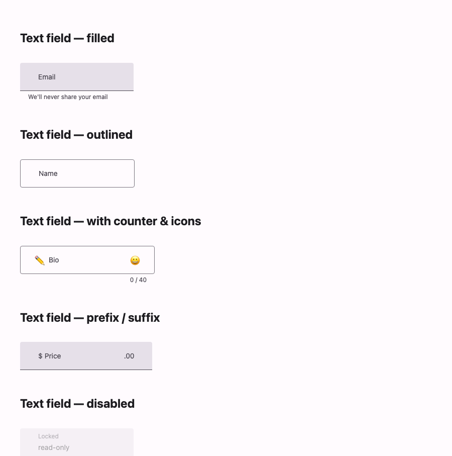

# @lit-material/text-field

A Material Design 3 text field web component built with [Lit](https://lit.dev/). Part of
[lit-material](https://github.com/bohdaq/lit-material).



Filled and outlined variants with a floating label, supporting/helper text, error states, a
character counter, prefix/suffix text, leading/trailing icon slots, and native form participation.

## Install

```sh
npm install @lit-material/text-field @lit-material/tokens
```

## Usage

```html
<link rel="stylesheet" href="node_modules/@lit-material/tokens/css/index.css" />
<script type="module">
  import "@lit-material/text-field";
</script>

<lit-material-text-field variant="filled" label="Email" type="email" supporting-text="We'll never share it"></lit-material-text-field>

<lit-material-text-field variant="outlined" label="Name" required error-text="Required"></lit-material-text-field>

<lit-material-text-field variant="outlined" label="Bio" maxlength="40">
  <span slot="leading-icon" aria-hidden="true">✏️</span>
</lit-material-text-field>

<lit-material-text-field variant="filled" label="Price" prefix="$" suffix=".00" type="number"></lit-material-text-field>
```

## API

| Property          | Attribute          | Type                 | Default    |
| ----------------- | ------------------ | -------------------- | ---------- |
| `variant`         | `variant`          | `"filled" \| "outlined"` | `"filled"` |
| `value`           | `value`            | `string`             | `""`       |
| `label`           | `label`            | `string`             | `""`       |
| `placeholder`     | `placeholder`      | `string`             | `""`       |
| `supportingText`  | `supporting-text`  | `string`             | `""`       |
| `errorText`       | `error-text`       | `string`             | `""`       |
| `error`           | `error`            | `boolean`            | `false`    |
| `disabled`        | `disabled`         | `boolean`            | `false`    |
| `required`        | `required`         | `boolean`            | `false`    |
| `readonly`        | `readonly`         | `boolean`            | `false`    |
| `prefix`          | `prefix`           | `string`             | `""`       |
| `suffix`          | `suffix`           | `string`             | `""`       |
| `type`            | `type`             | `string`             | `"text"`  |
| `min`             | `min`              | `number \| undefined`| `undefined`|
| `max`             | `max`              | `number \| undefined`| `undefined`|
| `minlength`       | `minlength`        | `number \| undefined`| `undefined`|
| `maxlength`       | `maxlength`        | `number \| undefined`| `undefined`|
| `step`            | `step`             | `string`             | `""`       |
| `pattern`         | `pattern`          | `string`             | `""`       |
| `autocomplete`    | `autocomplete`     | `string`             | `""`       |
| `inputmode`        | `inputmode`        | `string`             | `""`       |
| `name`            | `name`             | `string`             | `""`       |
| `form`            | `form`             | `string \| undefined`| `undefined`|

Slots: `leading-icon`, `trailing-icon`.

The label floats when the field is focused, holds a value, or has a placeholder. A character
counter renders when `maxlength` is set. The field is form-associated via `ElementInternals`
(participates in `FormData`, validation, and form reset) and forwards native constraint
validation: set `error`/`error-text` for custom errors, or rely on `required`/`pattern`/`min`/etc.
which surface an error state after the field is blurred (touched).

## License

MIT
