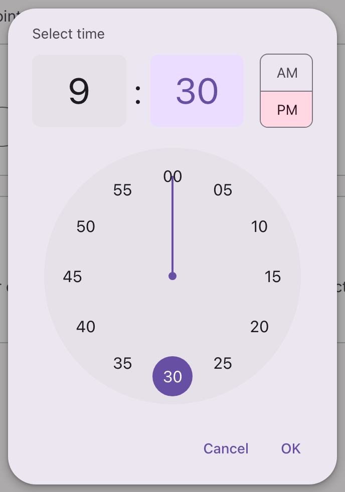

# @lit-material/time-picker

A Material Design 3 time picker web component built with [Lit](https://lit.dev/) — a clock-dial
dialog, built on the native `<dialog>` element like
[`@lit-material/dialog`](https://github.com/bohdaq/lit-material/tree/main/packages/dialog). No
prior pattern in this repo to build on; the dial is a fresh design, the most novel interaction of
any component here. Part of [lit-material](https://github.com/bohdaq/lit-material).



## Install

```sh
npm install @lit-material/time-picker @lit-material/tokens
```

## Usage

```html
<link rel="stylesheet" href="node_modules/@lit-material/tokens/css/index.css" />
<script type="module">
  import "@lit-material/time-picker";
</script>

<lit-material-button id="open-btn">Choose time</lit-material-button>
<lit-material-time-picker id="time-picker" value="14:30"></lit-material-time-picker>

<script type="module">
  const picker = document.querySelector("#time-picker");
  document.querySelector("#open-btn").addEventListener("click", () => picker.show());
  picker.addEventListener("change", () => console.log(picker.value));
</script>
```

24-hour format, no AM/PM toggle, and a second inner dial ring (13–23, 00) the way the MD3 spec's
24-hour dial works:

```html
<lit-material-time-picker hour-cycle="24" value="14:30"></lit-material-time-picker>
```

## API

| Property     | Attribute      | Type                   | Default        |
| ------------- | --------------- | ------------------------ | --------------- |
| `open`       | `open`          | `boolean`                | `false`        |
| `value`      | `value`         | `string \| undefined`   | `undefined`    |
| `hourCycle`  | `hour-cycle`    | `"12" \| "24"`           | `"12"`         |
| `label`      | `label`         | `string`                  | `"Select time"` |

`value` is a 24-hour `"HH:MM"` string (e.g. `"14:05"`) regardless of `hourCycle` — that only
controls the dial and displayed hour, not how the value is stored, the same way `<input
type="time">` always works in 24-hour values under the hood.

Methods: `show()` opens the picker, resetting its selection to `value` (or the current time) —
equivalent to `open = true` after that reset. `close(returnValue?)` closes it without confirming a
selection.

Fires `change` when a time is confirmed via "OK" and `value` actually changed; `cancel`/`close`,
re-dispatched from the native `<dialog>` events (Escape, a backdrop click, or the Cancel button all
land here) the same way
[`@lit-material/dialog`](https://github.com/bohdaq/lit-material/tree/main/packages/dialog)
re-dispatches its own.

## Behavior

Tap a number, or press and drag anywhere on the dial — mouse, touch, or pen, all through one
[Pointer Events](https://developer.mozilla.org/en-US/docs/Web/API/Pointer_events) code path — to
pick a value continuously; releasing after a drag started in hour mode auto-advances to minute
mode, the same progressive flow native OS time pickers use. Every number is a real `<button>`, so
Tab + Enter/Space reaches all of them without any custom keyboard handling on the dial itself.
Click the large hour or minute display to switch which one the dial is currently editing.

Tapping a value highlights it immediately but doesn't commit it — the same two-step "pick, then
confirm" flow
[`@lit-material/date-picker`](https://github.com/bohdaq/lit-material/tree/main/packages/date-picker)
uses. `change` only fires once "OK" is clicked; "Cancel" (or Escape, or a backdrop click) discards
the in-progress pick and leaves `value` untouched.

## Scope

Deliberately out of scope for this first pass, all reasonable follow-ups rather than silently
missing pieces:

- The manual keyboard-entry text field mode MD3 lets you toggle to — this is dial-only, matching
  `@lit-material/date-picker`'s own identical scope cut.
- A `docked` (non-modal, inline) variant — the MD3 spec doesn't define one for the time picker the
  way it does for the date picker, so there's nothing to build here.

## License

MIT
