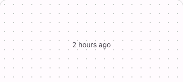

# @lit-material/timestamp

Material Design 3-styled timestamp web component built with [Lit](https://lit.dev/). Part of
[lit-material](https://github.com/bohdaq/lit-material).

A date/time display built on the native `<time>` element, with absolute or live-updating relative
formatting via `Intl.DateTimeFormat`/`Intl.RelativeTimeFormat`.



## Install

```sh
npm install @lit-material/timestamp @lit-material/tokens
```

## Usage

```html
<link rel="stylesheet" href="node_modules/@lit-material/tokens/css/index.css" />
<script type="module">
  import "@lit-material/timestamp";
</script>

<lit-material-timestamp date="2024-01-15T10:30:00Z"></lit-material-timestamp>

<lit-material-timestamp date="2024-01-15T10:30:00Z" relative></lit-material-timestamp>

<lit-material-timestamp date="2024-01-15T10:30:00Z" date-format="long" time-format="short"></lit-material-timestamp>
```

## API

| Property     | Attribute     | Type                                                | Default    |
| ------------ | ------------- | ---------------------------------------------------- | ---------- |
| `date`       | `date`        | `string`                                              | `""`       |
| `dateFormat` | `date-format` | `"full" \| "long" \| "medium" \| "short" \| "none"`   | `"medium"` |
| `timeFormat` | `time-format` | `"full" \| "long" \| "medium" \| "short" \| "none"`   | `"none"`   |
| `relative`   | `relative`    | `boolean`                                             | `false`    |
| `locale`     | `locale`      | `string`                                              | `""`       |

`date` is an ISO 8601 date-time string. `locale` is a BCP 47 tag (`"en-US"`, `"fr-FR"`, …);
unset defaults to the browser's own locale.

Slot: default — fallback content shown when `date` is empty or unparseable.

## Behavior

The `<time>` element's `datetime` attribute always holds the full ISO string regardless of how the
visible text is formatted, so assistive tech and other tooling relying on it get full precision
even when the display doesn't.

`relative` swaps the visible text for a live-updating relative phrase ("3 hours ago", "in 2 days"),
refreshed every 30 seconds while connected, with the absolute `dateFormat`/`timeFormat`-formatted
date always available in the native `title` tooltip — so precision is never more than a hover away,
even when the visible text is intentionally coarse.

## License

MIT
