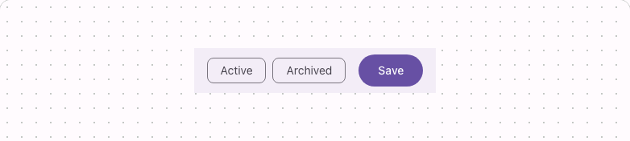

# @lit-material/toolbar

Material Design 3-styled toolbar web components built with [Lit](https://lit.dev/). Part of
[lit-material](https://github.com/bohdaq/lit-material).

A row of grouped controls — search fields, filter chips, buttons — above a piece of content, like a
data table or a list.



## Install

```sh
npm install @lit-material/toolbar @lit-material/tokens
```

## Usage

```html
<link rel="stylesheet" href="node_modules/@lit-material/tokens/css/index.css" />
<script type="module">
  import "@lit-material/toolbar";
</script>

<lit-material-toolbar>
  <lit-material-chip>Active</lit-material-chip>
  <lit-material-toolbar-spacer></lit-material-toolbar-spacer>
  <lit-material-button variant="filled">Save</lit-material-button>
</lit-material-toolbar>
```

## `lit-material-toolbar` API

| Property | Attribute | Type      | Default |
| -------- | --------- | --------- | ------- |
| `dense`  | `dense`   | `boolean` | `false` |

Slot: default — any elements, laid out as flex items (wrapping by default), plus
`lit-material-toolbar-spacer` where you want the following items pushed to the far end. `dense`
tightens the gap and padding for toolbars nested inside already-dense contexts.

Sets `role="toolbar"` on itself.

## `lit-material-toolbar-spacer` API

No properties. A `flex: 1 1 auto` element with no content of its own — place one between two groups
of toolbar items to push everything after it to the far end.

## Behavior

Slotted children are laid out directly as flex items of the host — there's no
`lit-material-toolbar-item` wrapper required, so any element (a button, a chip, a text field) works
as a toolbar child as-is.

Positioning (sticky, elevation) is left to the consumer, the same way `lit-material-top-app-bar`
leaves it — a toolbar shows up in enough different contexts (a page header, inside a card, inside a
dialog) that assuming one would be wrong more often than it'd help.

## License

MIT
