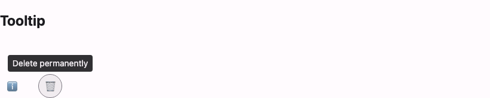

# @lit-material/tooltip

A Material Design 3 plain tooltip web component built with [Lit](https://lit.dev/). Part of
[lit-material](https://github.com/bohdaq/lit-material).



## Install

```sh
npm install @lit-material/tooltip @lit-material/tokens
```

## Usage

```html
<link rel="stylesheet" href="node_modules/@lit-material/tokens/css/index.css" />
<script type="module">
  import "@lit-material/tooltip";
</script>

<lit-material-icon-button id="info-btn" aria-label="Info">ℹ️</lit-material-icon-button>
<lit-material-tooltip anchor="info-btn">Shows account details</lit-material-tooltip>
```

That's it — the tooltip finds its anchor by id and wires up hover/focus itself. No `show()` call
needed for the common case (unlike
[`@lit-material/menu`](https://github.com/bohdaq/lit-material/tree/main/packages/menu), which
*is* driven by your own click handler).

## API

| Property     | Attribute     | Type                    | Default     |
| ------------- | -------------- | -------------------------- | ------------ |
| `open`        | `open`          | `boolean`                   | `false`      |
| `anchor`      | `anchor`        | `string \| undefined`      | `undefined`  |
| `showDelay`   | `show-delay`    | `number` (ms)               | `500`        |
| `hideDelay`   | `hide-delay`    | `number` (ms)               | `200`        |

Slot: default (the tooltip's text).

`anchorElement` (a getter/settable property, not an attribute) resolves from `anchor`'s id by
default, or set it directly for a reference that isn't a simple id lookup (e.g. an element in a
different root). Setting a new `anchor`/`anchorElement` re-binds all the hover/focus listeners to
the new element and moves `aria-describedby` off the old one.

Methods: `show()`/`hide()` bypass `showDelay`/`hideDelay` and act immediately — useful for driving
the tooltip from something other than hover/focus.

## Behavior

Built on the native Popover API (`popover="manual"`) the same way
[`@lit-material/menu`](https://github.com/bohdaq/lit-material/tree/main/packages/menu) and
[`@lit-material/snackbar`](https://github.com/bohdaq/lit-material/tree/main/packages/snackbar) are
— so it renders in the top layer, escaping `overflow: hidden`/clipped ancestors, without any of
`"auto"` mode's light-dismiss behavior (which this doesn't need: it's purely hover/focus driven,
not user-invoked).

Shows on the anchor's `mouseenter`/`focus` after `showDelay`; hides on `mouseleave`/`blur` after
`hideDelay`, or immediately on Escape. Positions above the anchor by default, flipping below if
that would go off the top of the viewport, and clamped horizontally to stay on-screen.

Sets `aria-describedby` on the anchor pointing at itself, so the tooltip's text is exposed to
assistive tech as a *description* of the anchor — not a replacement for the anchor's own
accessible name. Don't rely on a tooltip as the *only* label for an unlabeled icon button; give
the anchor its own `aria-label` too.

## Scope

Deliberately out of scope for this first pass: the MD3 "rich" tooltip variant (title + supporting
text + action buttons) and touch long-press triggering — this is the plain, hover/focus-only
variant.

## License

MIT
