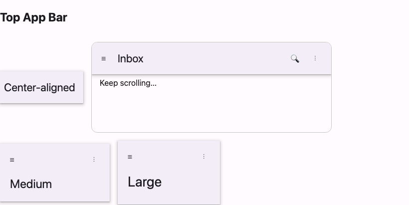

# @lit-material/top-app-bar

A Material Design 3 top app bar web component built with [Lit](https://lit.dev/). Part of
[lit-material](https://github.com/bohdaq/lit-material).



## Install

```sh
npm install @lit-material/top-app-bar @lit-material/icon-button @lit-material/tokens
```

## Usage

```html
<link rel="stylesheet" href="node_modules/@lit-material/tokens/css/index.css" />
<script type="module">
  import "@lit-material/top-app-bar";
  import "@lit-material/icon-button";
</script>

<lit-material-top-app-bar>
  Inbox
  <lit-material-icon-button slot="leading" aria-label="Menu">☰</lit-material-icon-button>
  <lit-material-icon-button slot="trailing" aria-label="Search">🔍</lit-material-icon-button>
  <lit-material-icon-button slot="trailing" aria-label="More options">⋮</lit-material-icon-button>
</lit-material-top-app-bar>
```

## API

| Property      | Attribute  | Type                                                     | Default   |
| ------------- | ---------- | --------------------------------------------------------- | --------- |
| `variant`     | `variant`  | `"center-aligned" \| "small" \| "medium" \| "large"`       | `"small"` |
| `elevated`    | `elevated` | `boolean`                                                  | `false`   |
| `scrollTarget`| —          | `HTMLElement \| undefined`                                 | `undefined` |
| `threshold`   | `threshold`| `number`                                                   | `4`       |

Slots: default (headline/title text), `leading` (typically a single navigation icon button),
`trailing` (action icon buttons, in order).

`center-aligned` and `small` are a single 64dp row; `medium` and `large` add a taller second row
below for a bigger headline. Layout/typography only — positioning (e.g. `position: sticky; top:
0;`) is left to your page, since a top app bar shows up in enough different contexts (a full
page, a panel, a dialog) that assuming one would be wrong more often than it'd help.

Scroll-driven elevation is built in: by default the bar watches `window` scroll and turns on
`elevated` (surface tint + shadow) once the page has scrolled past `threshold` pixels. Point
`scrollTarget` at a specific scrolling element instead of the window, or set `elevated` directly
if you're already tracking scroll position yourself.

Deliberately out of scope: the Large/Medium-collapses-to-Small-on-scroll morphing behavior from
the Material spec — that changes layout, not just elevation, and is a reasonable follow-up rather
than part of this first pass.

## License

MIT
