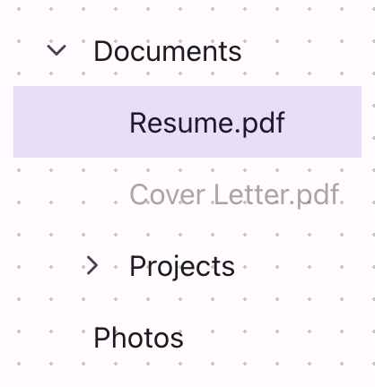

# @lit-material/tree

Material Design 3-styled hierarchical tree web components built with [Lit](https://lit.dev/). Part
of [lit-material](https://github.com/bohdaq/lit-material).

Two elements: `lit-material-tree-item` (a node — chevron if it has children, optional leading icon,
label, and arbitrarily nested children) and `lit-material-tree` (groups nodes, adding single- or
multi-select coordination and arrow-key navigation across every *visible* node), following the
WAI-ARIA [Tree View](https://www.w3.org/WAI/ARIA/apg/patterns/treeview/) pattern.



## Install

```sh
npm install @lit-material/tree @lit-material/tokens
```

## Usage

```html
<link rel="stylesheet" href="node_modules/@lit-material/tokens/css/index.css" />
<script type="module">
  import "@lit-material/tree";
</script>

<lit-material-tree id="files">
  <lit-material-tree-item expanded>
    <span slot="label">Documents</span>
    <lit-material-tree-item selected>
      <span slot="label">Resume.pdf</span>
    </lit-material-tree-item>
    <lit-material-tree-item>
      <span slot="label">Cover Letter.pdf</span>
    </lit-material-tree-item>
  </lit-material-tree-item>
  <lit-material-tree-item>
    <span slot="label">Photos</span>
  </lit-material-tree-item>
</lit-material-tree>
<script type="module">
  document.getElementById("files").addEventListener("change", (event) => {
    // Inspect .selected on the tree's lit-material-tree-item descendants.
  });
</script>
```

## `lit-material-tree` API

| Property   | Attribute  | Type      | Default |
| ---------- | ---------- | --------- | ------- |
| `multiple` | `multiple` | `boolean` | `false` |

Slot: default (top-level `lit-material-tree-item` elements — nest more inside each item for
deeper levels). Fires `change` when the selection changes via user interaction. `multiple` allows
more than one node selected at once (each click toggles that node); by default, selecting a node
deselects whatever else was selected anywhere in the tree, not just its immediate siblings.

## `lit-material-tree-item` API

| Property   | Attribute  | Type      | Default |
| ---------- | ---------- | --------- | ------- |
| `expanded` | `expanded` | `boolean` | `false` |
| `selected` | `selected` | `boolean` | `false` |
| `disabled` | `disabled` | `boolean` | `false` |

Slots: `label`, `leading` (an optional icon), default (nested `lit-material-tree-item` children).
Fires `toggle` (`detail: { expanded }`) when `expanded` changes via user interaction. `expanded` is
this node's own concern (click the chevron, or ArrowRight/Left); `selected` is always managed by
the parent `lit-material-tree` — set directly only for the initial state, since single-select mode
needs to be able to clear it from anywhere else in the tree. `lit-material-tree-item` isn't meant
to be used standalone the way `lit-material-accordion-panel` is: `role="treeitem"` requires a
`tree` or `group` role ancestor per ARIA, which only a wrapping `lit-material-tree` (or another
`lit-material-tree-item`) provides.

## Behavior

Clicking a node's row selects it; clicking its chevron (when it has children) only expands or
collapses it — the two are independent actions, and neither implies the other. A node's
indentation is derived purely from how many `lit-material-tree-item` ancestors it has, not a
property the tree manages.

## Keyboard interaction

Exactly one node has `tabindex="0"` at a time (roving tabindex, moved by the tree as focus moves).
Down/Up move focus to the next/previous *visible* node — collapsed branches' children are skipped
entirely — without wrapping past the first/last node, unlike `lit-material-tabs`' roving tabindex.
Right expands a collapsed branch (focus stays put) or moves focus into its first child if already
expanded; on a leaf node, it does nothing. Left is the mirror: collapses an expanded branch, or
moves focus to the parent node. Home/End jump to the first/last visible node. Enter/Space select
the focused node — matching the exact WAI-ARIA Tree View keyboard spec.

No typeahead (jump to a node by typing its first letter) — a reasonable scope cut for a first
version, same spirit as other components here that skip secondary keyboard affordances to keep the
implementation's surface area honest.

## License

MIT
